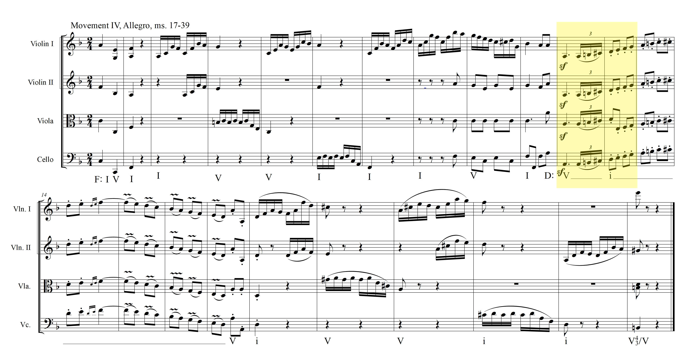
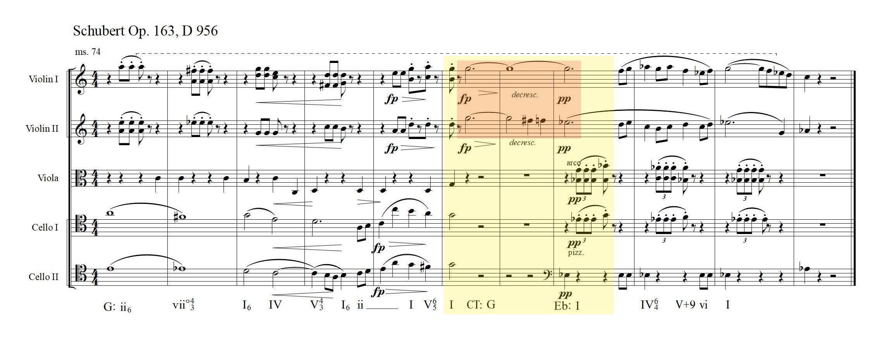

```{r packages, include=FALSE}
knitr::opts_chunk$set(echo = TRUE)

##  Libraries ----
library(knitr)
library(openxlsx)
library(tibble)
library(reshape2)
library(randomcoloR)
library("car")
library(ggpubr)
library(ggplot2)
library(olsrr)
library("papaja")
library("kableExtra")
library("citr")
library(plyr)
library("tidyverse")
library("InPosition")
library("ExPosition")
library("corrplot")
library("PTCA4CATA")
library("MBESS")
# knitr::write_bib(c("papaja", "openxlsx", "tibble", "reshape2", "randomcoloR", "car", "ggpubr",
#                   "ggplot2", "olsrr", "kableExtra", "citr", "plyr", "dplyr", "MBESS", "PTCA4CATA",
#                   "corrplot", "InPosition", "ExPosition", "tidyverse", "knitr", "musicography", "base"))

```

```{r stimdatain, include = FALSE}

# Get stimulus data: stimdatswap = "Stim data with A'", i.e. A' has already been calculated, and add headers. 

stimdatswap <- read.csv("stimdatswaps.csv", header = FALSE)
names(stimdatswap) <- c("stimno", "mod_type", "Key_dist", "mode_change", "hits", "hitr", "FAs", "FAr", "Apr")
rtsub <- read.xlsx("Participant_Data.xlsx", rows = 1:181, cols = 1:4) # reaction time by subject.
# This is a test scatter plot that includes a smooth line (?) (I'm not super sure what the "smooth" is for or what the line is supposed to represent)

scatter.smooth(x=stimdatswap$Key_dist, y=stimdatswap$Apr, main="A' by Key Distance")

# Regression of Key distance predicting A'
pd <- position_dodge(0.3) # initializing now so that it's usable throughout the entire script.


Aprbykey <- lm(Apr ~ Key_dist, data = stimdatswap[1:42, ])
kdss <- Anova(Aprbykey, type = 3)

aprbykey_plot <- ggplot(data = stimdatswap, aes(x = Key_dist, y = Apr)) +
                          geom_point(aes(x = Key_dist, y = Apr)) +
                          stat_smooth(method=lm)

aprbykey_plot2 <- ggplot(data = stimdatswap[1:42, ], aes(x = Key_dist, y = Apr)) +
                          geom_point(aes(x = Key_dist, y = Apr)) +
                          stat_smooth(method=lm)
                            


# ANOVA on A', grouped by mode change
test <- aov(Apr ~ mode_change, data = stimdatswap)
v <- aov(Key_dist ~ mod_type, data = stimdatswap)
v.s <- apa_print(v)
# run model again coding mode change as -1 and 1 (use effects coding), then switch 

# Multiple regression of Key distance and mode change predicting A'

# add column and code for effects codes
stimdatswap <- add_column(stimdatswap, mode_change_ec = stimdatswap$mode_change, .after = "mode_change")
stimdatswap$mode_change_ec[stimdatswap$mode_change == 0] <- -1

#add column and code as y/n
stimdatswap <- add_column(stimdatswap, "Mode_Change_yn"= stimdatswap$mode_change, .after = "mode_change_ec")
stimdatswap$'Mode_Change_yn'[stimdatswap$mode_change == 0] <- "no"
stimdatswap$'Mode_Change_yn'[stimdatswap$mode_change == 1] <- "yes"

#add column and reverse code
stimdatswap <- add_column(stimdatswap, mode_change_rc = stimdatswap$mode_change, .after = "Mode_Change_yn")
stimdatswap$mode_change_rc[stimdatswap$mode_change == 0] <- 1
stimdatswap$mode_change_rc[stimdatswap$mode_change == 1] <- 0

Aprbykey.mcec <- lm(Apr ~ Key_dist * mode_change_ec, data = stimdatswap[1:42, ])


#Next section's code comes from the R Graphics Cookbook (pp 94 - 99), by Winston Chang

make_model <- function(data) {
  lm(Apr ~ Key_dist, data)
}

predictvals <- function(model, xvar, yvar, xrange=NULL, samples = 100, ...){
  if (is.null(xrange)) {
    if (any(class(model) %in% c("lm", "glm")))
      xrange <- range(model$model[[xvar]])
    else if (any(class(model) %in% "loess"))
      xrange <- range(model$x)
  }
  
  newdata <- data.frame(x = seq(xrange[1], xrange[2], length.out = samples))
  names(newdata) <- xvar
  newdata[[yvar]] <- predict(model, newdata = newdata, ...)
  newdata
}

sdordered <- stimdatswap[1:42, ]
sdordered <- sdordered[order(sdordered$mode_change), ]


models <- dlply(.data = stimdatswap[1:42, ], .variables = "Mode_Change_yn", .fun = make_model)
predvals <- ldply(.data = models, .fun = predictvals, xvar = "Key_dist", yvar = "Apr")

abkmcecp <- ggplot(data = stimdatswap[1:42, ], aes(x = Key_dist, y = Apr, color = Mode_Change_yn, shape = Mode_Change_yn)) +
                   geom_point() +
    #geom_smooth(method = lm, se = FALSE ) +              
   geom_line(data = predvals, size = 1) +
   theme_bw() +
   theme(legend.position ="right") +
   xlab("Key Distance") +
   ylab("A'") +
   labs(color = "Mode Change", shape = "Mode Change")
   #ggtitle("Multiple Regression using Key Distance and Mode Change as Predictors")

bwcols <- c("gray12", "gray52")

bwcols <- matrix(nrow = 42, ncol = 1)
bwcols[ ,1] <- stimdatswap$mode_change[1:42]
bwcols[which(bwcols[ ,1]==1)] <- ("gray12")
bwcols[which(bwcols[ ,1]==0)] <- ("gray52")

abkmcecp_bw <- ggplot(data = stimdatswap[1:42, ], 
                      aes(x = Key_dist, y = Apr, color = Mode_Change_yn, 
                          shape = Mode_Change_yn)) +
                      geom_point(size = 2.5, position = "jitter") +
                      geom_line(data = predvals, size = 1) +
                      theme_apa() +
                      scale_color_grey() +
                      theme(legend.position ="right") +
                      xlab("Key Distance") +
                      ylab("A'") +
                      labs(color = "Mode Change", shape = "Mode Change")
                   


Aprbykey.mcdc <- lm(Apr ~ Key_dist * mode_change, data = stimdatswap[1:42, ])
Aprbykey.mcrc <- lm(Apr ~ Key_dist * mode_change_rc, data = stimdatswap[1:42, ])

#that section ends here


kmss <- Anova(Aprbykey, type = 3, )

# ANOVA of Mode Change (2) on A'

Aprbymc <- aov(Apr ~ mode_change, data = stimdatswap)

ssmc <- Anova(Aprbymc, type = 3)

#Anova of Modulation type (3) on A'

Aprbymt <- lm(Apr ~ mod_type, data = stimdatswap)

mtss <- Anova(Aprbymt, type = 3)


stimtemp <- stimdatswap[c(1:42) , c(1,12)]
tempodata <- read.csv("rtonly.csv", header = TRUE)
stimtemp <- add_column(stimtemp, tempo = tempodata$Tempo[1:42], .after = "Apr")

tempolm <- summary(lm(data = stimtemp, formula = Apr ~ tempo))

```

```{r subdatain, include = FALSE}


## Analysis of Subject A' Data for 2019 Modulation Perception study (first year project UTD)----
## Brendon Mizener
## 2019 - 8 - 27
##
##
##
##


#   Import data. ----

allsubjects <- read.table("compiledcsvs.txt", header = TRUE) ## compiledcsvs.txt contains each participants' hits and false alarms for each stimulus
subjectdata <- read.xlsx("Participant_Data.xlsx", rows = 1:181, cols = 1:4) #contains participant data: age, training, etc.
aprimedata <- read.table("aprime_data.txt", ',', header = FALSE) #contains A' statistics for overall and each subset, and the hits and false alarms and rates for each.

#   Data cleaning steps ----
allsubjects <- data.frame(allsubjects) 
allsubjects <- allsubjects[order(allsubjects$type) , ] #sorts allsubjects by modulation type
aprimeonly <- aprimedata[ , 1:5] #selects only the A' scores for each participant
names(aprimeonly) <- c("subject#", "apr_ovr", "apr_pc", "apr_dm", "apr_ct")   #rename columns to reflect values
aprimeonly <- add_column(aprimeonly, Class = subjectdata$Class, .before = "apr_ovr") #adds participant class (1 = untrained, 2 = moderate, 3 = high) from subjectdata spreadsheet
aprimeonly$Class <- as.factor(aprimeonly$Class) #sets "Class" as a factor, so it can be used properly in the analysis
aprimelong <- melt(aprimeonly, id.vars = c('subject#', 'Class'), measure.vars = c('apr_ovr', 'apr_pc', 'apr_dm', 'apr_ct')) #melts data into 4 columns
names(aprimelong) <- c('subject', "class", "modtype", "aprime")
years <- aprimeonly
years <- add_column(aprimeonly, years = subjectdata$Years.of.formal.training, .before = "apr_ovr")
years <- add_column(years, age = subjectdata$Age, .after = "years")

c12 <- distinctColorPalette(k = 12, altCol = FALSE, runTsne = FALSE)
c3 <- distinctColorPalette(k = 3, altCol = FALSE, runTsne = FALSE)


#   Analyses ----

# Simple Training level ANOVA w/ Tukey Test
training.lm <- with(aprimelong[1:180, ], lm(aprime ~ class))
training.aov <- with(aprimelong[1:180, ], aov(aprime ~ class))
tukey.training <- TukeyHSD(training.aov)

# Simple modulation type ANOVA w/Tukey Test
type.lm <- with(aprimelong[181:720, ], lm(aprime ~ modtype))
type.aov <- with(aprimelong[181:720, ], aov(aprime ~ modtype))
tukey.type <- TukeyHSD(type.aov)

# Interaction model ANOVA w/Tukey Test
m.c.lm <- with(aprimelong[181:720, ], lm(aprime ~ modtype * class))
m.c.anova <- Anova(m.c.lm, type = 3)
m.c.aov <- with(aprimelong[181:720, ], aov(aprime ~ class * modtype))
tukeybyall <- TukeyHSD(m.c.aov)
cbym <- data.frame(tukeybyall$`class:modtype`)
sig.int <- data.frame(cbym$p.adj) < .05
sig.int <- cbym[sig.int, ]
#write.csv(x = sig.int, file = "sig_int.csv")


# Regression of years of training on overall score
y.lm <- with(years, lm(apr_ovr ~ years))
y.a.mr <- with(years, lm(apr_ovr ~ age + years))

# Test for influential data points
cdcheck <- with(aprimeonly, lm(apr_ovr ~ Class))
cdcheck.chart <- ols_plot_cooksd_chart(cdcheck)

# Post-hoc cleaning and analysis ----

icds <- c(2, 25, 26, 70, 157, 167) # subjects who were identified by cdcheck as influential data points
apocdo <- aprimeonly[-icds, ]      # dataframe of A' values with invfluential data points (identified as surpassing cook's distance) taken out 
summary(with(apocdo, aov(apr_ovr ~ Class)))
apocdo.long <- melt(apocdo,  id.vars = c('subject#', 'Class'), measure.vars = c('apr_ovr', 'apr_pc', 'apr_dm', 'apr_ct')) #melts data into 4 columns
names(apocdo.long) <- c('subject', "class", "modtype", "aprime")

# Anova of Cook's distances 
mtaov.cdo <- with(apocdo.long, aov(aprime ~ class * modtype))
tukeytmtcdo <- TukeyHSD(mtaov.cdo)


## Plots ----

t.aov.plot <- plot(training.aov) #plots generated by the training anova
m.aov.plot <- plot(type.aov) #plots generated by the modulation type
aprime.box <-ggboxplot(data = aprimelong, x = "class", facet.by = "modtype", y = "aprime", color = "class", label.select = list(top.down = 5) )

aprimeonly.2 <- aprimeonly[order(aprimeonly$Class), ]
aprimemeans <- matrix(c(mean(aprimeonly.2[1:60, 3]), mean(aprimeonly.2[61:120, 3]), mean(aprimeonly.2[121:180, 3]), 
                        mean(aprimeonly.2[1:60, 4]), mean(aprimeonly.2[61:120, 4]), mean(aprimeonly.2[121:180, 4]), 
                        mean(aprimeonly.2[1:60, 5]), mean(aprimeonly.2[61:120, 5]), mean(aprimeonly.2[121:180, 5]), 
                        mean(aprimeonly.2[1:60, 6]), mean(aprimeonly.2[61:120, 6]), mean(aprimeonly.2[121:180, 6])), nrow = 3, ncol = 4)
colnames(aprimemeans) <- c("ovr", "p", 'd', "c")
rownames(aprimemeans) <- c("low", "moderate", "high")
aprimemeans.m <- melt(aprimemeans, measure.vars = c("ovr", "p", "d", "c"))
colnames(aprimemeans.m) <- c("training", "modtype", "aprime")
aprimemeans.line <- ggplot(data = data.frame(aprimemeans.m[4:12, ]), aes(x = modtype, y = aprime, color = training)) + 
                      geom_boxplot(aes(color = training,  group = training), size = 1)
                      


#training.box <- ggboxplot(data = aprimeonly, x = "Class", y = "apr_ovr")
#training.dens <- ggdensity(aprimelong, x = "aprime", add = "mean", rug = TRUE, color = "class", 
#                           fill = "class", palette = c3)  
# modtype.aov <- with(allsub, aov(value ~ variable))
# modtype.box <- ggboxplot(allsub, x = "modtype", y = "aprime", color = "modtype", palette = c("#00AFBB", "#E7B800", "#FC4E07"))
# modtype.dens <- ggdensity(allsub, x = "aprime", add = "mean", rug = TRUE, color = "modtype", 
#                          fill = "modtype", palette = c("#00AFBB", "#E7B800", "#FC4E07"))  
  

#p2 <- ggplot(allsub.m) + geom_boxplot(aes(x = partclass, y = value, color = variable))
#p1 <- ggplot(allsub, aes(x = partclass, y.1 = pivot, y.2 = direct, y.3 = common)) + geom_boxplot()
#an <- aov(formula = partclass ~ pivot + direct + common, data = allsub, na.rm = TRUE)
#save.image(file = "C:\\Users\\Brendon\\Desktop\\Western\\Data\\plots.Rdata")


apocdo <- apocdo[order(apocdo$Class), ]
apocdo.means <- matrix(c(mean(apocdo[1:57, 3]), mean(apocdo[58:116, 3]), mean(apocdo[117:174, 3]), 
                         mean(apocdo[1:57, 4]), mean(apocdo[58:116, 4]), mean(apocdo[117:174, 4]), 
                         mean(apocdo[1:57, 5]), mean(apocdo[58:116, 5]), mean(apocdo[117:174, 5]), 
                         mean(apocdo[1:57, 6]), mean(apocdo[58:116, 6]), mean(apocdo[117:174, 6])), nrow = 3, ncol = 4)
colnames(apocdo.means) <- c("ovr", "p", 'd', "c")
rownames(apocdo.means) <- c("low", "moderate", "high")
apocdo.means.m <- melt(apocdo.means, measure.vars = c("ovr", "p", "d", "c"))
colnames(apocdo.means.m) <- c("training", "modtype", "aprime")
apocdo.means.line <- ggplot(data = data.frame(apocdo.means.m), aes(x = modtype, y = aprime, color = training)) + geom_line(aes(color = training, group = training), size = 1) + geom_point()


```

```{r Response Time, include = FALSE}


##    Import data----

rt <- read.table("rtonly.txt", header = TRUE)
rtsub <- read.xlsx("Participant_Data.xlsx", rows = 1:181, cols = 1:4)

##    Clean Data----

cols = c(1:5,186)
rtstim <- rt[1:49 , cols]
rtstim <- add_column(rtstim, apr = stimdatswap$Apr, .after = "rtmeanstim")

rtsub$Participant_ID = c(1:180)

rvec <- rt[50, 6:185]
rvec <- t(rvec)
rownames(rvec) <- rownames(rtsub)
rpcvec <- rt[51, 6:185]
rdmvec <- rt[52, 6:185]
rctvec <- rt[53, 6:185]
rpcvec <- t(rpcvec) 
rdmvec <- t(rdmvec) 
rctvec <- t(rctvec)
row.names(rpcvec) <- rownames(rtsub)
row.names(rdmvec) <- rownames(rtsub)
row.names(rctvec) <- rownames(rtsub)

rtsub <- add_column(rtsub, meanrt = rvec, .after = "Years.of.formal.training")
rtsub <- add_column(rtsub, pcrt = rpcvec, .after = "meanrt")
rtsub <- add_column(rtsub, dmrt = rdmvec, .after = "pcrt")
rtsub <- add_column(rtsub, ctrt = rctvec, .after = "dmrt")
colnames(rtsub) <- c("p.id", "age", "class", "y.t", "meanrt", "pcrt", "dmrt", "ctrt")
rtsub <- add_column(rtsub, apr_ovr = aprimedata$V2, .after = "ctrt")

rtsub$pcrt[rtsub$pcrt == 0] <- NA
rtsub$dmrt[rtsub$dmrt == 0] <- NA
rtsub$ctrt[rtsub$ctrt == 0] <- NA

rtsub$pcrt[is.nan(rtsub$pcrt)] <- NA
rtsub$dmrt[is.nan(rtsub$dmrt)] <- NA
rtsub$ctrt[is.nan(rtsub$ctrt)] <- NA

rtlong <- melt(rtsub, id.vars = c("p.id", "class"), measure.vars = c("pcrt", "dmrt", "ctrt", "meanrt"), value.name = "Reaction_Time", variable.name = "Modulation_Type" )

rtintaov <- with(rtlong, aov(Reaction_Time ~ Modulation_Type))

rtgroupmeans <- ddply(rtlong, c("class", "Modulation_Type"), summarise,
                N = length(Reaction_Time),
                mean = mean(Reaction_Time, na.rm = T),
                sd = sd(Reaction_Time, na.rm = T),
                se = sd/sqrt(N))  

group.rt.plot <- ggplot(data = rtgroupmeans, aes(x = Modulation_Type, y = mean,  color =  as.factor(class))) +
                  geom_errorbar(aes(ymin = mean-se, ymax = mean+se), width = .1, position = pd, size = 1) +
                  #geom_line(size = .5,  position = pd) +
                  geom_point(position = pd, size = 4, shape = 21, fill = "white") +
                  geom_text(aes(x = Modulation_Type, y = mean, label=round(mean, 2), hjust = 1.8)) +
                  xlab("Modulation type") +
                  ylab("Mean response time (s)") +
                  scale_colour_hue(name="Level of Training",
                                   breaks = c("1", "2", "3"),
                                   labels = c("Nonmusician (< 2 yrs)", "Moderate training (2 - 10 yrs)", "Highly trained (10+ yrs)"), 
                                   l=40) +
                    # ggtitle("Differences in response time by modulation type between groups") +
                    expand_limits(y = c(.5:1.1)) +
                    scale_y_continuous(breaks = c(.5, 1, 1.5, 2), labels = c(.5, 1, 1.5, 2)) +
                    scale_x_discrete(breaks = c("pcrt", "dmrt", "ctrt", "meanrt"), labels = c("Pivot chord", "Direct", "Common tone", "Overall mean"))+
                  labs(color = "Participant Training Level") +
                 # scale_x
                    theme_bw() +
                    theme(legend.justification = c(1,0), legend.position = c(1,0))

group.rt.apa <- ggplot(data = rtgroupmeans, aes(x = Modulation_Type, y = mean, fill = as.factor(class))) +
   geom_bar(color = "black", stat = "identity", position = "dodge") +
   geom_errorbar(aes(ymin = mean-se, ymax = mean+se), width = .1, size = 1, position = position_dodge(.9)) +
   geom_text(aes(x = Modulation_Type, y = mean, label=round(mean, 2)), position = position_dodge(.9), vjust = -4, color = "black", size = 2.5) + 
   scale_fill_grey(name="Level of Training", 
                   labels = c("Nonmusician (< 2 yrs)", "Moderate training (2 - 10 yrs)", "Highly Trained (10+ yrs)"), 
                        breaks = c("1", "2", "3"), ) +
   scale_x_discrete(breaks = c("pcrt", "dmrt", "ctrt", "meanrt"), labels = c("Pivot chord", "Direct", "Common \ntone", "Overall \nmean")) +
   theme_apa() + 
   coord_cartesian(ylim=c(0, 2.3)) +
   xlab("Modulation Type") +
   ylab("Mean response time (s)")
   
   

##    Analysis by Subject/Training Level----

subrt.aov <- aov(meanrt ~ factor(class), data = rtsub)
summary(subrt.aov)
subrt.tukey <- TukeyHSD(subrt.aov)
subrt.lm <- with(rtsub, lm(meanrt ~ class))
summary(subrt.lm)

rtap <- summary(lm(meanrt ~ apr_ovr, data = rtsub))

rtvaprsub <- ggplot(data = rtsub, mapping = aes(x = meanrt, y = apr_ovr)) +
                    geom_point(color = rtsub$class) + 
                    stat_smooth(method = "lm") +
                    theme_bw() +
                    theme(legend.justification = c(1,0), legend.position = c(1,0))
                    
                  

                


##    Analysis by Stimulus/Modulation type----

stimrt.aov <- with(rtstim[1:42, ], aov(rtmeanstim ~ factor(type)))
summary(stimrt.aov)
stimrt.tukey <- TukeyHSD(stimrt.aov)

##    Analysis by Stimulus and key distance----

stimrt.lm <- with(rtstim[1:42, ], lm(rtmeanstim ~ KeyDistance))
summary(stimrt.lm)


stimrt.lm.plot <- ggplot(data = rtstim[1:42, ], aes(x = KeyDistance, y = rtmeanstim)) +
                        geom_point() +
                        stat_smooth(method = "lm") +
                        ylab("Mean Response Time") +
                        xlab("Key Distance") +
   ggtitle("Response time by key distance") +
   scale_y_continuous(breaks = c(.5, 1.5, 2, 2.5, 3,3.5), labels = c(.5, 1.5, 2, 2.5, 3,3.5)) +
   scale_x_continuous(breaks = c(.5, 1, 1.5, 2), labels = c(.5, 1, 1.5, 2)) +
                        theme_bw() +
                        theme(legend.justification = c(1,0.1), legend.position = c(1,0.1))
  

##    Analysis of interactions----


## Plots

rtsubmeans <- ddply(rtsub, "class", summarise,
                N = length(meanrt),
                mean = mean(meanrt),
                sd = sd(meanrt),
                se = sd/sqrt(N))

sub.rt.plot <- ggplot(data = rtsubmeans, aes(x = class, y = mean,  color =  class)) +
                  geom_errorbar(aes(ymin = mean-se, ymax = mean+se), width = .1, position = pd, size = 1) +
                  #geom_line(size = .5,  position = pd) +
                  geom_point(position = pd, size = 4, shape = 21, fill = "white") +
                  geom_text(aes(x = class, y = mean, label=round(mean, 2), hjust = 1.5)) +
                  xlab("Listener training level") +
                  ylab("Mean response time") +
                  #scale_colour_hue(name="Modulation Type",
                                  # breaks = c("1", "2", "3"),
                                  # labels = c("Nonmusician (< 2 yrs)", "Moderate training (2 - 10 yrs)", "Highly Trained (10+ yrs)"), 
                                   #l=40) +
                    #ggtitle("Differences in response time by training level") +
                    expand_limits(y = c(.5:1.1)) +
                    scale_y_continuous(breaks = c(.5, 1, 1.5, 2), labels = c(.5, 1, 1.5, 2)) +
                    scale_x_continuous(breaks = c(1, 2, 3), labels = c(1, 2, 3)) +
                    theme_bw() +
                    theme(legend.position = "none")

pcfix <- rtstim$type == "1"
dmfix <- rtstim$type == "2"
ctfix <- rtstim$type == "3"
rtstim$type[pcfix] <- "1. Pivot Chord"
rtstim$type[dmfix] <- "2. Direct"
rtstim$type[ctfix] <- "3. Common Tone"

rtstimmeans <- ddply(rtstim[1:42, ], "type", summarise,
                N = length(rtmeanstim),
                mean = mean(rtmeanstim),
                sd = sd(rtmeanstim),
                se = sd/sqrt(N))

sub.rt.plot <- ggplot(data = rtstimmeans, aes(x = type, y = mean,  color =  type)) +
                  geom_errorbar(aes(ymin = mean-se, ymax = mean+se), width = .1, position = pd, size = 1) +
                  #geom_line(size = .5,  position = pd) +
                  geom_point(position = pd, size = 4, shape = 21, fill = "white") +
                  geom_text(aes(x = type, y = mean, label=round(mean, 2), hjust = 1.5)) +
                  xlab("Modulation type") +
                  ylab("Mean response time") +
                  #scale_colour_hue(name="Modulation Type",
                                  # breaks = c("1", "2", "3"),
                                  # labels = c("Nonmusician (< 2 yrs)", "Moderate training (2 - 10 yrs)", "Highly Trained (10+ yrs)"), 
                                   #l=40) +
                    #ggtitle("Differences in response time by modulation type") +
                    expand_limits(y = c(.5:1.1)) +
                    scale_y_continuous(breaks = c(.5, 1, 1.5, 2), labels = c(.5, 1, 1.5, 2)) +
                    theme_bw() +
                    theme(legend.position = "none")

```

  Listener understanding of pitch center, or tonic, is fundamental to understanding musical structures from the smallest musical motif to the large-scale structures that define musical form. The tonic in a musical phrase is the pitch that represents the foundation of that tonal hierarchy [@Krumhansl1979b; @Krumhansl1982c; @Lerdahl1983]. Listeners become aware of the tonic in a given composition through a number of musical and perceptual cues related to melody and melodic expectancy [@Brown1988; @Dowling1986; @Lerdahl1983] and harmony and phrase structure [@Huron1993; @Krumhansl1982a]. Additionally, it has been well established that music listeners implicitly understand the concept of a key, or set of notes, and its tonic [@Dowling1978a; @Krumhansl1982c; @Krumhansl1979b], but much less work has been done on understanding our perception of the motion between different tonic centers within a single composition. This process of moving between key centers is called *modulation*.  
  Modulation allows the composer to use a wider palette for musical expression. Western classical music theorists have defined several types of modulation, each of which is characterized by its own parameters and musical theoretical constructs.  One question that arises from these concepts is whether or not the listener is perceptually aware of the composer’s intent: does the listener perceive the progression from key center to key center with no more information than can be grasped by listening? Underlying this question is the question of how humans percieve tonality.  
  One model of tonal perception in humans comes from studies using the probe-tone method (Krumhansl & Shepard, 1979), which has often been replicated. This method involves participants rating the goodness of fit of a given note in a musical context, with the probe tone played either immediately after the music [@Krumhansl1979b; @Vuvan2011] or concurrently with the music [@Toiviainen2003a; @Raman2016]. The first use of this method was to rate how well each note in the chromatic scale completed an ascending scale [@Krumhansl1979b]. The results of this study established the model of the tonal hierarchy for major and natural minor keys. Vuvan, Prince, & Schmuckler (2011) extended this work to map the melodic and harmonic forms of minor. 
  Toiviainen & Snyder (2003) further extended the probe-tone model to track listener perception of key in a dynamic context. This allowed the creation of a model that showed how the perception of tonality changed over time, beyond a static context. Further applications appear in Cuddy & Thompson (1992), who tracked modulations specifically and found that both trained and untrained listeners were able to judge the distance chord progressions modulated from the original tonic with a high degree of consistency. Additionally, Raman & Dowling (2017) performed an interesting cross-cultural study that showed effects of both training and enculturation in western and Indian listeners when tracking modulations in South Indian Classical (Carnātic) music.  
  Krumhansl and Kessler (1982) used an extension of the this to model perceived tonal organization by having listeners rate probe tones iteratively with each successive addition of a chord in a chord progression. They found both a recency effect for key information and a distance effect that resulted in cognitive lag for assimilation. The further a progression modulated, the longer it took for participants to process the modulation and internalize the new key. Krumhansl (1990) combined the data from Krumhansl and Shepard (1979) and those from Krumhansl and Kessler (1982) to create map of tonalities, projected on the surface of a torus, modeling the apparent cognitive distance between key centers.  
  Despite what some would describe as a functional deficit in the probe-tone method (Butler, 1989, 1990), it has been found to be robust, thanks to the replication and converging evidence presented in studies enumerated above. There are other models, including the rare intervals hypothesis (Butler, 1989; see also Browne, 1990, and Brown & Butler, 1981) and Huron and Parncutt’s (1993) model. The latter incorporates short-term echoic memory, in an effort to address a concept that may seem obvious to music listeners, namely that: “both structural and functional factors” (Huron & Parncutt, 1993) contribute to the perception of tonality.  
  We would suggest that all of these mechanisms explain part of the apparatus for tonality induction. Given the multifaceted nature of music (melody, harmony, rhythm, timbre, and their interactions) and its presentation to listeners, it makes sense that listeners would need multiple deductive paradigms to figure out what is going on in the navigation of tonal space. The system likely incorporates all of this information simultaneously to arrive at an answer.  
  We attempt here to address some of the questions that arise from the probe-tone method. Specifically, because it depends fundamentally on a listener’s rating of dissonance between a given chromatic pitch and the harmonic and melodic cues at any point during a piece, it doesn’t address a whether or not listeners track key information, or, more relevant for the current study, information about the relationship between keys. One apparent deficit is seen in the dynamic map that is a product of Toiviainen & Krumhansl (2003). It appears to track chord progressions by way of micro-scale judgments of perceived dissonance, rather than the tonic area per se. Defenders of the probe-tone model argue that this is an oversimplification, and that the sum of the overall judgments made by listeners in the probe-tone model pinpoints the tonic area via correlations of patterns of judgments. That study, however, is one of only a few that uses naturalistic stimuli, which are used for the present study and should be a goal of future research on this topic.


## Modulation as a Music-Theoretical Construct
  Many of our ideas about music perception are based on a tradition in music theory that begins with Rameau's *Treatise on Harmony* (1722/1971). Fundamental to current models of tonal music perception is the concept of a central or foundational pitch: the tonic [@Krumhansl1990]. This is the note against which other notes and groups of notes are compared to guide our understanding of phrase, tonality, and closure (cadences) [@Sears2015a]. However, as the tonic is not present in every moment of western music, our understanding of tonic is also shaped by the harmonic structures that surround it [@Butler1989]. A key or tonal hierarchy is the group of notes that surround the tonic, which are both defined by and, conversely, define the tonic itself. The pattern of keys is often presented visually as the circle of Fifths (see Figure \@ref(fig:C05)).
  
\begin{figure}
  \caption{\\The circle of fifths.}
  \label{fig:C05}
  \begin{center}
    \includegraphics[width=0.6\textwidth]{RTMParticle_files/Circleo5nb.png}
  \end{center}
\end{figure}

```{r Co5, echo = FALSE, include = FALSE, out.width='60%', fig.align = 'center', fig.show='hold'}

knitr::include_graphics("RTMParticle_files/Circleo5nb.png", )

```

  Each letter around the circumference of the concentric circles represents the tonic of a major (outer) and a minor (inner) key. Moving from one vertex to another constitutes a change in the tonal center of a key; a modulation. Moving to either of the adjacent vertices in the current ring or the corresponding vertices in the other (for C: G, F, a, d, and e) is considered to be a modulation to a near key; moving further than that is considered a distant modulation. 
  Because the tonic of a key is determined both by hierarchy and by the intervallic pattern of the notes that surround it, each new key requires sharps (which raise a note by a semitone) or flats (which lower a note by a semitone), and in a few cases, both. The number of sharps and flats that each key requires are listed in the center of the circle. The key of C has no sharps and no flats. The number of sharps and flats offers one measure of similarity between keys - adding one sharp or flat changes one note relative to the key adjacent. More sharps or flats results in greater difference between keys. A mode change is a change from major to minor or vice-versa. Moving the key up or down a fifth does not require a change in mode, but moving to the relative or parallel minor does.^[However, as @Krumhansl1982a notes, there are conflicting opinions on whether a shift to the relative minor counts as a key change at all, since there are no changes in the set of pitches that makes up the key.]

## *Types of Modulation*
  The three types of modulation considered for this study are: direct modulation, common tone modulation, and pivot chord modulation. There are other types of modulation codified in the western classical tradition, but we selected these three as maximally distinct. Each of these types of modulation features specific characteristic surface features that distinguish it. Our hope with this selection is to determine what surface features, if any, are effective cues in listener identification of change in key. 

\begin{figure}
  \caption{\\Basic example of a pivot chord modulation.}
  \label{fig:pcshort}
  \begin{center}
    \includegraphics[width=1\textwidth]{images/PCshort.png}
  \end{center}
  \caption*{\footnotesize \textit{Note.}  The progression is analyzed in C Major and G Major, with the roman numeral analysis in C after the modulation included for illustrative purposes. The highlighted chord is the pivot chord.}
\end{figure}
  

```{r pcshort, include = FALSE, echo = FALSE, out.width='100%', fig.align = 'center', fig.show='hold', fig.cap = 'Basic example of a pivot chord modulation. The progression is analyzed in C Major and G Major, with the roman numeral analysis in C after the modulation included for illustrative purposes. The highlighted chord is the pivot chord.'}
  knitr::include_graphics("images/PCshort.png")
```

  **Pivot Chord Modulation.** A pivot chord modulation occurs when a composer uses a chord that is common to, and has a similar function^[I.e. pre-dominant function, dominant function. This means that the chord in question serves a certain purpose within the phrase. Tonic is a place of rest, dominant is a place of tension, and pre-dominant sets up the dominant harmony.] in, two different keys, serving as a pivot to move from one key to another [@Benjamin2003]. For purposes of this experiment, we selected only excerpts in which the pivot chord was common in both its root (note on which the chord is based) and its quality (major or minor) in the two keys. Figure \@ref(fig:pcshort) illustrates the progression described here. The target key for this type of modulation is often the dominant, with a vi chord as a pivot.^[A note on typography: throughout this paper, chords are indicated in two ways: with roman numerals, with the number indicating the scale degree on which the chord is built, and using letters. Letters also indicate scale degrees. Notes or scale degrees on which unaltered triads (chords consisting of 3 notes, each an interval of a third from the one below it) form major chords are denoted by capital letters or roman numerals, and those on which unaltered triads form minor chords are denoted by lowercase. Diminished chords are indicated by a lowercase letter or numeral with a °. Hat signs ( $\hat{}$ ) indicate scale degrees, i.e. $\hat{7}$ is the seventh scale degree.] This creates a vi – II^7^ – V progression in the starting key that matches a ii – V^7^ – I progression in the target key.^[Note that ii in a major key should be minor, so the II with a seventh added is an altered chord (II^7^)] The example in Figure \@ref(fig:pcexfig)^[All examples transcribed using Finale v. 25 for Windows.] shows a similar progression. The highlighted area indicates a I - V - vi^7^ in the key of E\fl, where the vi^7^ serves pre-dominant function in both keys. 

\begin{figure}
  \caption{\\Excerpt featuring a pivot chord modulation.}
  \label{fig:pcexfig}
  \begin{center}
    \includegraphics[width=1\textwidth]{images/pivot_chord.jpg}
  \end{center}
  \caption*{\footnotesize \textit{Note.}  Haydn op. 2 No. 3, Mvt. 1, ms. 1 - 27. The large and small highlighted areas represent the modulating phrase and the pivot chord, respectively. Source: Haydn (1765/1845), transcription by Mizener.}
\end{figure}

```{r pcexfig, include = FALSE, echo = FALSE, out.width='100%', fig.align = 'center', fig.show='hold'}

knitr::include_graphics("images/pivot_chord.jpg")

``` 


  **Direct Modulation.** Though there is a technical distinction between direct and phrase modulation, we consider them functionally equivalent here. Phrase modulation occurs at a phrase boundary: a composer finishes a phrase in one key and begins the next phrase in a new key immediately after, with no transition material. Direct modulation occurs when an abrupt modulation happens somewhere other than a phrase boundary [@Benjamin2003]. These modulations are often made to closely related keys, as defined earlier. However, because of the abrupt nature of the modulation, modulating to a close key is not a necessity, and many composers have used this technique to modulate much further.  
  Figure \@ref(fig:dmexfig) is an excerpt from Beethoven's String Quartet in F major, op. 18 No 1, Mvt. 4: Allegro, in which the modulation moves from F major to d minor (tonic to relative minor). The initial I\musFig{6 4} - V - I progression clearly establishes F major before moving back and forth between tonic and dominant harmony. Immediately on the downbeat of the eleventh measure, Beethoven switches suddenly to a d minor harmony by landing aggressively on the tonic of the V chord. The scale leading to the tonic, played in unison, uses the melodic minor scale by raising the B\fl\ to a B\na\ and C\na\ to a C\sh\ and landing on D on the downbeat of the twelfth measure. This dominant-tonic motion and the subsequent a melodic minor scale over the  next two measures solidly establish the d minor harmony. The underscore in the figure indicates the sustained tonic harmony implied by the scale in its entirety.


```{r dmexfig, include=F, echo = FALSE, out.width='100%', fig.align = 'center', fig.show='hold'}

```

```{=latex}
\begin{figure}
  \caption{\\Excerpt featuring a direct modulation.}
  \label{fig:dmexfig}
  \begin{center}
    \includegraphics[width=1\textwidth]{images/direct.jpg}
  \end{center}
  \caption*{\footnotesize \textit{Note.}  Beethoven String Quartet No. 1 in F Major, op. 18, No. 1, mvt. 4, ms. 17-39. The highlighted area represents the modulation from F major to D minor. Although there are two measures highlighted, there is no 'transition material' moving between the two keys, and the modulation occurs directly on the downbeat of measure 11 of the excerpt. Source: Beethoven (1800/1937), transcription by Mizener.}
\end{figure}
```

  **Common Tone Modulation.** A common tone modulation occurs when a composer uses a single sustained or repeated pitch or dyad (two pitches sounding simultaneously) to link two keys. This can occur either in the middle of a phrase or at a phrase boundary. The common tone is present in both keys but can serve either similar or different function in either key. Often, but not necessarily, the pitch is present in the tonic chord of both keys [@Benjamin2003]. Because the only feature linking the two keys is a single pitch or dyad, the two keys need not be closely related. This modulation serves as an efficient way to connect distant keys. Figure \@ref(fig:ctexfig) is an excerpt from Franz Schubert's String Quintet in C Major, D. 956, movement 1. The sixth measure of the excerpt starts in G, and the violins both sustain the tonic across the barline, where the second violin moves down to an E\fl, using the progression $\hat{3}$-\sh$\hat{2}$-$\hat{2}$-$\hat{1}$ in E\fl\ and $\hat{1}$-$\hat{7}$-\fl$\hat{7}$-\fl$\hat{6}$. This containes notes that fit into both keys and allow for a gradual transition to the new tonic. The E\fl\ in the second violin is supported by the second cello on the first beat of the next measure and then repeated by the second cello on the second beat of the measure, firmly establishing the new key.

```{r ctexfig, include = FALSE, echo = FALSE, out.width='100%', fig.align = 'center',  fig.show='hold'}

```

```{=latex}
\begin{figure}
  \caption{\\Excerpt featuring a common tone modulation.}
  \label{fig:ctexfig}
  \begin{center}
    \includegraphics[width=1\textwidth]{images/common_tone.jpg}
  \end{center}
  \caption*{\footnotesize \textit{Note.}  Schubert's String Quintet in C Major, D. 956, Movement 1, measures 74 - 84. The large and small highlighted areas represent the modulating phrase and the common tone, respectively. The dashed bracket at the top of the excerpt represents the specific area that was played for the participant. Material outside of the bracket included for visual continuity. Source: Schubert (1828/1965), transcription by Mizener.}
\end{figure}
```

## Present questions
  The questions we consider for the present experiment are as follows: Do music listeners passively retain information on key region independent of topical, salient features of the music? To what extent does training affect the storage, processing, and access to that information, if it exists? What topical features influence our understanding of key regions and the movement between them? What is the balance between melodic and harmonic features contributing to that understanding?  
  To be clear, we do not claim that these musical elements are truly independent. we seek rather to investigate the level to which they are considered independently, or the level to which each is effective when making judgments within a musical context. For a long time, studies surrounding key area processing focus solely on either melodic material [@Dowling1986; @Bartlett1980; @Krumhansl1982c] or harmonic material [@Thompson1989a]. Only recently have researchers begun to use more naturalistic stimuli, such as excerpts or MIDI recreations in their research [@Toiviainen2003a]. @Krumhansl1983 argues convincingly that the various features of a musical piece are all interdependent and contribute to the processing of key area. It remains a question, however, what musical information takes priority in terms of salience during listening, and whether or not that information receives similar priority during processing. For the purpose of this study, we consider both melody and harmony to be topical, salient features. The information that would be "background" is not the harmonic motion per se, or even the chord qualities, but rather the relative implications, or functions of the chords in the context of the key. These chordal functions are readily understood upon harmonic analysis of a written score, but may not be understood by passive or even active listening. 
  We therefore propose four hypotheses. First, that groups of participants who have greater levels of training, across all modulation types, will be more accurate. Should this hypothesis be supported, it would represent evidence that training is a significant factor in key recognition retention. Should it not be supported, and we find that instead, accuracy is independent of training, it would suggest that training is not necessary for key retention. This in turn suggests that key tracking is obtained through passive listening to music.  
Secondly, across levels of training, the responses to the pivot chord modulation will be the least accurate, responses to the direct modulations will be the most accurate, and the responses to common tone modulations will fall in the middle. This hypothesis most directly addresses the question of topical salient musical features, and makes two specific predictions. Firstly, that different types of modulations, and the topical features of each, will inform listener perceptions to different degrees, and that the movement between the two keys will be recognized with different levels of accuracy. Secondly, it makes a specific prediction about the relative levels of accuracy that each of the specific modulation types will see. If participants were to respond to all of the modulation types with equal accuracy, it would suggest that topical features and key area recognition are independent of one another. This would support the idea that the perception of movement between key areas, and therefore the recognition of tonic area per se, are unaffected by topical features.  
Next, key distance and mode change will be more accurate predictors of modulation perception. Excerpts that feature a mode change as part of the modulation should be more accurately recognized, likewise with greater key distance. This hypothesis, like hypothesis number two, also deals with topical features. Should these features be found to represent more accurate responses, it would suggest that those specific features guide perception to a greater extent than other types of musical features.  
Finally, we hypothesize that trained listeners will respond faster to the modulations than untrained listeners. Hypothesis four, like hypothesis one, addresses the question of training, but from a different perspective. Faster response time in trained listeners would suggest that the key area processing becomes more efficient as a result of training. 

# Method  
## Participants and group assignments  
```{r participant numbers, include = FALSE}

meanage <-  mean(subjectdata$Age)
sdage   <-  sd(subjectdata$Age)
byc     <-  subjectdata[order(subjectdata$Class), ]
ltmean  <-  mean(byc$Years.of.formal.training[1:60])
ltsd    <-  sd(byc$Years.of.formal.training[1:60])
mtmean  <-  mean(byc$Years.of.formal.training[61:120])
mtsd    <-  sd(byc$Years.of.formal.training[61:120])
htmean  <-  mean(byc$Years.of.formal.training[121:180])
htsd    <-  sd(byc$Years.of.formal.training[121:180])

```
  The majority of participants for this study were adults selected from the UT Dallas undergraduate SONA pool. These students were compensated with credit towards their psychology research exposure requirements. Some participants were also recruited from the music department at Northwestern State University in Natchitoches, Louisiana (NSULA), and some professional musicians and music educators from around the region were recruited through direct personal correspondence. Participants who were not students at UT Dallas were not compensated.  
  Approximately equal numbers of male and female participants participated in the study (M = 92, F = 87, NB^[Non-Binary] = 1), but gender was not considered. Participants' mean age was `r printnum(meanage)` (*SD* = `r printnum(sdage)`).  Participants were excluded if they met any of the following criteria: exposure to or training in South Indian Classical (Carnātic) Music; absolute pitch; or a hearing disability such as deafness, tinnitus, or amusia. Participants were evenly divided into three groups (n = 60) based on years of formal music training. Participants with zero to two years of formal music training were assigned to the nonmusician/untrained category, those with three to 10 years of formal training were assigned to the moderately-trained category, and those with 10 years or more of training were assigned to the highly-trained musician category. The nonmusician group had a mean of `r printnum(ltmean)` years of training (*SD* = `r printnum(ltsd)`), moderately-trained musicians had a mean of `r printnum(mtmean)` years of training (*SD* = `r printnum(mtsd)`), and highly trained musicians had a mean of `r printnum(htmean)` years of training (*SD* = `r printnum(htsd)`). Additionally, participants who had less than 10 years of training but had completed an Advanced Placement^TM^ or college-level aural skills training course also qualified for the highly-trained musician category. There were only four participants who met those criteria, who had nine, eight, five, and five years of training, respectively. For purposes of this study, formal music training was considered any time spent pursuing music in a formal setting, including instrumental or vocal large ensemble experience, small ensemble experience, and private lessons.  
  
## Stimuli  

  Stimuli were selected from the string quartet, quintet, and sextet works of Joseph Haydn (1732-1809), Roman Hofstetter (1742-1815), Wolfgang Amadeus Mozart (1756-1791), Ludwig van Beethoven (1770-1827), Franz Schubert (1797-1828), and Johannes Brahms (1833-1897). The string quartet idiom was selected to most effectively control the effects of timbre.  A full list of excerpts and recordings is included in Appendix 1. Each of the excerpts were chosen to meet specific structural criteria. These criteria included length, the presence of a single modulation, surrounded on either side by a stable tonic area, and enough time to instantiate the intial key before the modulation occurred. The shortest stimulus was 21.05 s and the longest was 59.66 s, with a mean length was 28.98 s. Each stimulus included at least six seconds of stable establishment of tonic before the modulation occurred.    
  Each excerpt was ripped from its source CD using fre:ac version 1.0.32 [@Kausch2018], an open-source audio converter. Stimuli were presented as .wav files to ensure the highest quality audio signal, using Koss model UR 20 headphones, if participants were run in the lab, or on Vic Firth^TM^ brand over-ear isolation headphones, to ensure presentation quality and isolation from external noise. Because stimuli were authentic recordings, they were presented without volume edits to preserve musicality. Participants adjusted volume to their comfort.  
  Trial stimuli were differentiated into three groups (n = 14), with each group representing a specific type of modulation: direct, pivot chord, and common tone. These three types of modulations were chosen to be maximally distinct. A fourth group of stimuli presented were lures that did not modulate (n = 7). The non-modulating stimuli were selected such that one excerpt from each composer was represented, except for Haydn, who was represented twice. Thus there were a total of 49 excerpts presented to participants, with a combined duration of 22m 59s.   
  In addition to being balanced across modulation types, test stimuli were also balanced across the three modulating conditions as to how many of each type changed mode during the modulation, as this was hypothesized to serve an obvious cue that a modulation has occurred. The excerpts were not balanced by starting mode, however, and more common tone excerpts started in the minor mode than any other. This is likely a negligible artifact, however, because the minor mode is not per se a cue that a modulation is going to happen.  
  Tempos for all stimuli were assessed to determine approximate tempo. In order to rule out any specific effects of tempo, we ran a simple post-hoc regression correlating *A*' and tempo, which was nonsignificant. Across all 14 stimuli, for each modulating condition, the average tempo was as follows: pivot chord, 112.64 beats per minute (bpm); direct, 115.00 bpm, and common tone, 114.50 bpm. Across the range of tempi included in the test stimuli, from a minimum of 43 bpm to a maximum of 236 bpm, the overall average was 114.05.  
  For each stimulus, we determined through aural and theoretical score analysis a critical time period in which the modulation or imitation lure occurred. Using that as a reference, we determined a time window in which a response would indicate an accurate reaction to, and therefore, perception of, the modulation. The window for each modulation began either on the modulation, as in the case of a direct modulation, or at the first indication of a modulation, which for the common tone excerpts was the beginning of the sustained note. The window for each modulation ended at the confirmation of the new key. For most excerpts this occured on a tonic chord of an authentic cadence in the new key. Most stimuli also had a designated window in which a response would count as a false alarm. These lure windows included such artifacts as secondary dominants^[For example: V/V - V - I, read as "five of five going to five, going to one". The "five of five" is the secondary dominant here - the dominant of the dominant.], strongly emphasized minor chords, or non-harmonic tones, all of which resolved to the original tonic. None of these false alarm windows overlapped with the modulation windows and none could be considered true modulations.   

## Key Distance
  Traditionally in music, key distance is measured by the distance around the circle of fifths, illustrated in Figure \@ref(fig:Co5). This distance does a good job of measuring distance in terms of note differences, but doesn't accurately reflect the psychophysical or perceptual difference between keys, because, for example, a modulation from major to relative minor and major to its dominant would have the same distance, which does not account for the change in mode from major to minor, the added sharp note in the dominant key signature, or the effect of the intervallic distance between the tonics of two keys [@Kleinsmith2018].  
  A more effective approach to mapping key distance is that of @Krumhansl1990, that served as the basis for Toiviainen and Krumhansl's 2003 study. Krumhansl used multi-dimensional scaling to map each of the keys, using their correlation profiles, [@Krumhansl1982a; @Krumhansl1990] onto a four-dimensional space. These were then mapped onto a torus, which was used by @Toiviainen2003a as the spatial mapping for their concurrent probe-tone visualization. Using this model as a representation of a four-dimensional vector space, we were able to calculate the euclidean distance between each set of four coordinates. This method allowed us to determine a distance between each of the keys that accurately reflected the key correlation (i.e. the distance around the circle of fifths) and the psychophysical effects of mode change. Because each key is located at a specific point in four dimensional space, each of the calculated vectors between the keys is unique. However, there were some patterns that emerged. For example, the calculated distance between two keys separated by the interval a fifth was approximately 0.86. The smallest distance between any two keys was between a given tonic and its relative minor (e.g. C to a minor), approximately 0.65. The largest distance between any two keys was approximately 2, which was the distance between any two keys separated by a tritone (e.g. I - \fl V/ \sh IV; C to F\sh / G\fl). The largest key distance for any excerpt in this experiment was 1.892, between c minor and A major. An ANOVA on the key distances of the stimuli indicated that there was not a significant difference in key distances among modulation types. 
  
## Procedure
Participants participated in the experiment at the MPaC lab at UT Dallas Main Campus, or another quiet, distraction-free environment as necessary. Following consent procedures, participants completed a questionnaire about the extent of their music training. Researchers then gave participants instructions on how to complete the task. Participants who were unfamiliar with the concept of a modulation received a brief introduction to the concept of tonality and modulation. Many participants who were not trained musicians were more comfortable with the term “key change”, and we used that connection to help those participants understand the overall concept. Once participants expressed a satisfactory understanding of the concepts, they were given instructions as to how to complete the task. Participants were then given a brief explanation of what they were to listen for, and that they should press the designated key on the keyboard when they hear the modulation within the stimulus. Participants were informed that they could respond as many times as they liked during any given excerpt, but that each excerpt only contained at most one modulation, and there were some excerpts that did not modulate. Participants were not informed in advance of what types of modulation to expect.^[A few highly-trained participants asked if they should consider the relative minor a key change. The response given was always "Respond when you think you're in a new key"] Stimuli were presented using Matlab version R2009B [@Various2009] using code adapted from @Raman2017. Responses in the modulation window were recorded as hits and responses in the false alarm window were recorded as false alarms. Responses outside of either window were evaluated as noise and not considered for the purposes of this analysis. Participants moved through the excerpts at their own pace, beginning each excerpt at their leisure following the completion of the previous one. Participants were allowed to take breaks as they felt necessary. Excerpts were presented in a different random order for each subject to mitigate any effects of ordering.

## Design & Hypotheses  
The planned analyses we considered for this experiment dealt with training, type of modulation, key distance, and response time. The first analysis we did was to find *A*' given hits and false alarms for all participants for all excerpts.^[*A*' is an estimate of the unbiased proportion of correct responses where chance equals 0.50.] we then calculated average response time for each participant, and average time for each participant by modulation type, all of which were compared using planned Tukey tests with corrections for multiple comparisons.  
  

# Results 
## Training Level and Modulation type  

``` {r results, include = FALSE}
#library(MBESS)
#library(PTCA4CATA)
options(tinytex.verbose = TRUE)
hyp1 <- apa_print(m.c.aov) # 3 X 3 Mixed ANOVA of A' given Modulation type (within) and training level (between)

h1effects <- data.frame(matrix(nrow = 6, ncol = 4))

rownames(h1effects) <- c("Nonmusicians vs. Moderately-trained", "Highly-trained vs. Nonmusicians", "Highly-trained vs. Moderately-trained", "Direct Modulation vs. Pivot Chord Modulation", "Common Tone Modulation vs. Pivot Chord Modulation", "Common Tone Modulation vs. Direct Modulation") 
colnames(h1effects) <- c("*d*", "lower limit", "upper limit", "*p* value")
h1effects[1:3, ] <- tukeybyall$class
h1effects[4:6, ] <- tukeybyall$modtype 
h1effects[ , 4] <- printp(h1effects[ ,4])
aprstandard <- sd(aprimelong[181:720, 4])
h1effects[ ,1] <- (h1effects[ ,1]/aprstandard)

h1cod <- matrix(nrow = 6, ncol = 3)

for (i in 1:dim(h1effects[1]))
{j <- 180

fart <- ci.smd(smd = h1effects[i,1], n.1 = j, n.2 = j, alpha.lower = .975, alpha.upper = .975)
h1cod[i,1] <- fart$smd
h1cod[i,3] <- fart$Lower.Conf.Limit.smd
h1cod[i,2] <- fart$Upper.Conf.Limit.smd

   }

h1effects[ ,1:3] <- h1cod


h1exp <- kable(h1effects, format = "latex", booktabs = TRUE, linesep = "", 
               digits=2, align = "c", col.names = c("$d$", "lower limit", "upper limit", "$p$ value"), escape = F) %>%
            kable_styling(latex_options = c("HOLD_position", "scale_down")) %>%
            footnote(number = c("Significance values adjusted for a familywise error rate of 95%; ", '"lower limit" and "upper limit" refer to the lower and upper limits of the 95% confidence interval for effect size.'))

hyp2   <- apa_print(Aprbykey) # simple regression of A' by key distance
hyp2.1 <- apa_print(Aprbykey.mcdc) # multiple regression of A' by key distance * mode change
hyp2.2 <- apa_print(Aprbykey.mcrc) # same as hyp2.1, with mode Reverse-coded, so that the mode change = 0 and no mode change = 1
hyp3   <- apa_print(subrt.aov) # ANOVA of reaction time by training level
hyp3.1 <- apa_print(stimrt.lm)

h3effects <- data.frame(matrix(nrow = 6, ncol = 4))
rownames(h3effects) <- c("Nonmusicians vs. Moderately-trained", "Highly-trained vs. Nonmusicians", "Highly-trained vs. Moderately-trained", "Direct Modulation vs. Pivot Chord Modulation", "Common Tone Modulation vs. Pivot Chord Modulation", "Common Tone Modulation vs. Direct Modulation") 
colnames(h3effects) <- c("*d*", "lower limit", "upper limit", "*p* value")
h3effects[1:3, ] <- subrt.tukey$`factor(class)`
h3effects[4:6, ] <- stimrt.tukey$`factor(type)`
h3effects[ , 4] <- printp(h3effects[ ,4])
rtstandard <- sd(rtlong$Reaction_Time, na.rm = T)
h3effects[ ,1] <- (h3effects[ ,1]/rtstandard)
h3cod <- matrix(nrow = 6, ncol = 3)

for (i in 1:3)
{j <- 180

fart <- ci.smd(smd = h3effects[i,1], n.1 = j, n.2 = j, alpha.lower = .975, alpha.upper = .975)
h3cod[i,1] <- fart$smd
h3cod[i,3] <- fart$Lower.Conf.Limit.smd
h3cod[i,2] <- fart$Upper.Conf.Limit.smd

}

for (i in 4:6)
{j <- 14

fart <- ci.smd(smd = h3effects[i,1], n.1 = j, n.2 = j, alpha.lower = .975, alpha.upper = .975)
h3cod[i,1] <- fart$smd
h3cod[i,3] <- fart$Lower.Conf.Limit.smd
h3cod[i,2] <- fart$Upper.Conf.Limit.smd

}


h3effects[ ,1:3] <- h3cod


hthreeexp <- kable(h3effects, format = "latex", booktabs = TRUE, linesep = "", 
               digits=2, align = "c", col.names = c("$d$", "lower limit", "upper limit", "$p$ value"), escape = F) %>%
            kable_styling(latex_options = c("HOLD_position", "scale_down"))  %>%
           footnote(number = c("Significance values adjusted for a familywise error rate of 95%.", '"lower limit" and "upper limit" refer to the lower and upper limits of the 95% confidence interval for effect size.'))

barf <- data.frame(tukeybyall$`class:modtype`)
tag <- barf[which(barf$'p.adj' < .05), ]
tag <- tag[c(2, 16, 5, 8, 11, 14), ]
tag[ ,1:3] <- tag[ ,1:3]/aprstandard
tag[ ,4] <- printp(tag[ ,4])
for (i in 1:dim(tag[1]))
{j <- 180
fart <- ci.smd(smd = tag[i,1], n.1 = j, n.2 = j, alpha.lower = .975, alpha.upper = .975)
tag[i,1] <- fart$smd
tag[i,3] <- fart$Lower.Conf.Limit.smd
tag[i,2] <- fart$Upper.Conf.Limit.smd
}
tag[ ,1:3] <- round(tag[ ,1:3], 2)
rownames(tag) <- c("1 - CT vs. 1 - PC", "1 - CT vs. 1 - DM", "2 - DM vs. 2 - PC", "2 - CT vs. 2 - PC", "3 - DM vs. 3 - PC", "3 - CT vs. 3 - PC")

cap <- data.frame(c("Groups: 1 = Untrained, 2 = Moderate training, 3 = Highly trained; Modulation types: CT = Common Tone, D = Direct,",
                         "PC = Pivot Chord; Significance values after adjusting for multiple comparisons, lower limit and upper limit refer to the",
                         "lower and upper limits of the 95% confidence interval for effect size."))

tagtab <- kable(tag, format = "latex", booktabs = TRUE, linesep = "",
                digits=2, align = "c", col.names = c("Cohen's $d$", "lower limit", "upper limit", "$p$ value"), escape = F, 
                caption = "Significant Differences Among Training Levels and Modulation Types") %>%
                kable_styling(full_width = F, font_size = 10, latex_options = "scale_down")  %>%
                column_spec(column = c(2:5), width = "1.2in") %>%
                footnote(cap[,1])

                            

cbmtints <- kable(tag)
cbmtints

taggedtable <- apa_table(tag, caption = "Significant Differences Among Training Levels and Modulation Types", note = 'Groups: 1 = Untrained, 2 = Moderate training, 3 = Highly trained. \\nModulation types: CT = Common Tone, D = Direct, PC = Pivot Chord. \\nSignificance values adjusted for a familywise error rate of 95%. \\n"lower limit" and "upper limit" refer to the lower and upper limits of the 95% confidence interval for effect size.')


ofix <- aprimelong$modtype == "apr_ovr"
pfix <- aprimelong$modtype == "apr_pc"
dfix <- aprimelong$modtype == "apr_dm"
cfix <- aprimelong$modtype == "apr_ct"

aprimelong$modtype <- as.character(aprimelong$modtype)

aprimelong$modtype[ofix] <- "1. Overall"
aprimelong$modtype[pfix] <- "2. Pivot Chord"
aprimelong$modtype[dfix] <- "3. Direct"
aprimelong$modtype[cfix] <- "4. Common Tone"

aprimelong$modtype <- as.factor(aprimelong$modtype)

aprimesummary <- ddply(aprimelong, c("class", "modtype"), summarise, 
                       N = length(aprime),
                       mean = mean(aprime),
                       sd = sd(aprime),
                       se = sd/sqrt(N))

ameans <- ddply(aprimelong, "modtype", summarise,
                N = length(aprime),
                mean = mean(aprime),
                sd = sd(aprime),
                se = sd/sqrt(N))

apm.g <- ggplot(ameans, aes(x = modtype, y = mean,  color =  modtype, shape = modtype)) +
                  geom_errorbar(aes(ymin = mean-se, ymax = mean+se), width = .1, position = pd, size = 1) +
                  #geom_line(size = .5,  position = pd) +
                  geom_point(position = pd, size = 4, fill = "white") +
                  geom_text(aes(x = modtype, y = mean, label=round(mean, 2), hjust = 1.5)) +
                  xlab("Modulation Type") +
                  ylab("A`") +
                  scale_colour_hue(name="Modulation Type",
                                   breaks = c("1", "2", "3"),
                                   labels = c("Nonmusician (< 2 yrs)", "Moderate training (2 - 10 yrs)", "Highly Trained (10+ yrs)"), 
                                   l=40) +
                    ggtitle("Differences in means between modulation conditions, across training levels") +
                    expand_limits(y = c(.5:1.1)) +
                    scale_y_continuous(breaks = c(.5, .6, .7, .8, .9), labels = c(.5, .6, .7, .8, .9)) +
                    theme_bw() +
                    theme(legend.position = "none")

apm.g_apa_bw <- ggplot(ameans, aes(x = modtype, y = mean,  fill = modtype)) +
   geom_bar(color = "black", stat = "identity", position = "dodge") +
   geom_errorbar(aes(ymin = mean-se, ymax = mean+se), width = .1, size = 1, position = position_dodge(.9)) +
   geom_text(aes(x = modtype, y = mean, label=round(mean, 2)), position = position_dodge(.9), vjust = -4, color = "black", size = 3) + 
   scale_fill_grey(guide = FALSE) +
   theme_apa() +
   coord_cartesian(ylim=c(.5, .9)) +
   xlab("Modulation Type") +
   ylab("Mean A'")

apm.g_apa <- ggplot(ameans, aes(x = modtype, y = mean,  fill = modtype)) +
   geom_bar(color = "black", stat = "identity", position = "dodge") +
   geom_errorbar(aes(ymin = mean-se, ymax = mean+se), width = .1, size = 1, position = position_dodge(.9)) +
   geom_text(aes(x = modtype, y = mean, label=round(mean, 2)), position = position_dodge(.9), vjust = -2, color = "black", size = 4) + 
   scale_fill_discrete(guide = FALSE, l=50) +
   theme_apa() + 
   coord_cartesian(ylim=c(.5, .9)) +
   xlab("Modulation Type") +
   ylab("Mean A'")


apm.l <- ggplot(aprimesummary, aes(x = modtype, y = mean, color = class, shape = class)) +
                  geom_errorbar(aes(ymin = mean-se, ymax = mean+se), width = .1, position = pd, size = 1) +
                  geom_line(aes(group = class, color = class), size = .5,  position = pd) +
                  geom_point(position = pd, size = 4, fill = "white") +
                  geom_text(aes(x = modtype, y = mean, label=round(mean, 2), hjust = 1.8)) +
                  xlab("Modulation Type") +
                  ylab("A`") +
                  scale_shape_discrete(labels = c("Nonmusician (< 2 yrs)", "Moderate training (2 - 10 yrs)", "Highly Trained (10+ yrs)")) +
                  scale_color_discrete(labels = c("Nonmusician (< 2 yrs)", "Moderate training (2 - 10 yrs)", "Highly Trained (10+ yrs)")) +
                  labs(shape = "Level of Training", color = "Level of Training")+
                  scale_color_hue(breaks = c("1", "2", "3"),
                                   labels = c("Nonmusician (< 2 yrs)", "Moderate training (2 - 10 yrs)", "Highly Trained (10+ yrs)"), 
                                   l=40, 
                                   ) +
                    ggtitle("The Effect of Training on Modulation Perception") +
                    expand_limits(y = c(.5:1.1)) +
                    scale_y_continuous(breaks = c(.5, .6, .7, .8, .9), labels = c(.5, .6, .7, .8, .9)) +
                    theme_bw() +
                    theme(legend.justification = c(1,0), legend.position = c(1,0.01))
                  
apm.b_apa_bw <- ggplot(aprimesummary, aes(x = modtype, y = mean, fill = class)) +
   geom_bar(color = "black", stat = "identity", position = "dodge") +
   geom_errorbar(aes(ymin = mean-se, ymax = mean+se), width = .1, size = 1, position = position_dodge(.9)) +
   geom_text(aes(x = modtype, y = mean, label=round(mean, 2)), position = position_dodge(.9), vjust = -4, color = "black", size = 2.5) + 
   scale_fill_grey(labels = c("Nonmusician (< 2 yrs)", "Moderate training (2 - 10 yrs)", "Highly Trained (10+ yrs)"), 
                        breaks = c("1", "2", "3"), ) +
      scale_x_discrete(breaks = c("1. Overall", "2. Pivot Chord", "3. Direct", "4. Common Tone"), 
                    labels = c("Overall \nmean", "Pivot \nChord", "Direct", "Common \ntone")) +
   theme_apa() + 
   coord_cartesian(ylim=c(.5, .9)) +
   xlab("Modulation Type") +
   ylab("Mean A'")

apm.b_apa <- ggplot(aprimesummary, aes(x = modtype, y = mean, fill = class)) +
   geom_bar(color = "black", stat = "identity", position = "dodge") +
   geom_errorbar(aes(ymin = mean-se, ymax = mean+se), width = .1, size = 1, position = position_dodge(.9)) +
   geom_text(aes(x = modtype, y = mean, label=round(mean, 2)), position = position_dodge(.9), vjust = -4, color = "black", size = 2.5) + 
   scale_fill_discrete(labels = c("Nonmusician (< 2 yrs)", "Moderate training (2 - 10 yrs)", "Highly Trained (10+ yrs)"), 
                        breaks = c("1", "2", "3"), l=50) +
   scale_x_discrete(breaks = c("1. Overall", "2. Pivot Chord", "3. Direct", "4. Common Tone"), 
                    labels = c("Overall \nmean", "Pivot \nChord", "Direct", "Common \ntone")) +
   theme_apa() + 
   coord_cartesian(ylim=c(.5, .9)) +
   xlab("Modulation Type") +
   ylab("Mean A'")      


```

  A three by three mixed ANOVA comparing modulation type and training level with *A*' as the dependent variable indicated significant simple main effects of training, `r hyp1$statistic$class[1]`, and modulation type, `r hyp1$statistic$modtype[1]`, as well as a significant interaction, `r hyp1$statistic$class_modtype[1]`. A Tukey test indicated that there was a significant difference between the highly trained group and the nonmusician group, Cohen's *d*^[Hereafter listed simply as *d*, not to be confused with the signal detection theory measure *d*'. In the current context, *d* represents the standardized mean difference between the means of the groups, calculated using the pooled standard deviation as a standardizer.] = `r round(h1effects[2, 1], 2)`, 95% CI [`r round(h1effects[2, 2], 2)`, `r round(h1effects[2, 3], 2)`], *p *`r h1effects[2, 4]`, as well as between the highly trained group and the moderately-trained group, *d =* `r round(h1effects[3, 1], 2)`, 95% CI [`r round(h1effects[3, 2], 2)`, `r round(h1effects[3, 3], 2)`], *p* < .001. However, the difference between the moderately-trained group and the nonmusician group was not significant, *d* = `r round(h1effects[1, 1], 2)`, 95% CI [`r round(h1effects[1, 2], 2)`, `r round(h1effects[1, 3], 2)`], *p* =  `r h1effects[1, 4]`. These results are all depicted graphically in  Figure \@ref(fig:grapha).   
  The simple main effect of modulation type was significant, and a Tukey test indicated that the differences between each of the modulation types were all significant. Between direct modulation and pivot chord modulation was a difference of *d* = `r round(h1effects[4, 1], 2)`, 95% CI [`r round(h1effects[4, 2], 2)`, `r round(h1effects[4, 3], 2)`], *p* `r h1effects[4, 4]`, between common tone modulation and pivot chord modulation was a difference of *d* = `r round(h1effects[5, 1], 2)`, 95% CI [`r round(h1effects[5, 2], 2)`, `r round(h1effects[5, 3], 2)`], *p* `r h1effects[5, 4]`, between common tone modulation and direct modulation was a difference of *d* = `r round(h1effects[6, 1], 2)`, 95% CI [`r round(h1effects[6, 2], 2)`, `r round(h1effects[6, 3], 2)`], *p* = `r h1effects[6, 4]`.  The results of the analysis by modulation type are all depicted in Figure \@ref(fig:graphb), and within-group significant differences by modulation type are presented in Table 1. 


```{r tagtable, echo = F}

tagtab

```


```{r grapha, include = F, echo = F, out.width='100%', fig.align = 'center', fig.show = 'hold'} 

apm.b_apa_bw
#apm.b_apa

```
```{=latex}
\begin{figure}
\caption{\\Relative accuracy of participants on the modulation perception task.}
\label{fig:grapha}
\begin{center}
\includegraphics[width=.75\linewidth]{RTMParticle_files/figure-latex/grapha-1}
\end{center}
\caption*{\footnotesize \textit{Note.}  Reported values of the A' statistic, showing both within and between - group effects. Error bars represent the standard error of the mean.}
\end{figure}
```

```{r graphb, include = F, echo = F, out.width='100%', fig.align = 'center', fig.show = 'hold'} 


apm.g_apa_bw
#apm.g_apa

```  
```{=latex}
\begin{figure}
\caption{\\Relative accuracy of participants on the modulation perception task.}%
\label{fig:graphb}
\begin{center}
\includegraphics[width=.75\linewidth]{RTMParticle_files/figure-latex/graphb-1}
\end{center}
\caption*{\footnotesize \textit{Note.}  Relative accuracy, represented by A', of participants on the modulation perception task, overall and modulation condition means. Error bars represent the standard error of the mean.}
\end{figure}
```

```{r mcgraph, include = F, echo = F, include = F, out.width = '100%', fig.align = 'center',  fig.show='hold'}
  
abkmcecp_bw

```
```{=latex}
\begin{figure}
\caption{\\Relative accuracy of participants on the modulation perception task.}%
\label{fig:mcgraph}
\begin{center}
\includegraphics[width=.75\linewidth]{RTMParticle_files/figure-latex/mcgraph-1}
\end{center}
\caption*{\footnotesize \textit{Note.}  Multiple regression using key distance and mode change as predictors.}
\end{figure}
```


## Key Distance
  A simple regression predicting *A*' from key distance was significant, `r hyp2$full_result$modelfit$r2`, `r hyp2$estimate$modelfit$r2_adj`, such that greater key distance indicated less accurate response, `r hyp2$estimate$Key_dist`. A multiple regression including both key distance and mode change was also found to be significant overall, `r hyp2.1$full_result$modelfit$r2`. In this model, key distance was not found to be significant, `r hyp2.1$full_result$Key_dist`, but mode change was marginally significant, `r hyp2.1$full_result$mode_change`, while the interaction between the two was found to be significant `r hyp2.1$full_result$Key_dist_mode_change`.  These results are illustrated in Figure \@ref(fig:mcgraph).  

## Reaction Time  
  Analysis of reaction time across training levels indicated a significant effect of training level, `r hyp3$full_result$factorclass`, and a Tukey test revealed significant differences between the highly trained musicians and non musicians group, *d* = `r round(h3effects[2, 1], 2)`, 95% CI [`r round(h3effects[2, 2], 2)`, `r round(h3effects[2, 3], 2)`], *p *`r h3effects[2, 4]`, and  the highly trained group and the moderately-trained group, *d* = `r round(h3effects[3, 1], 2)`, 95% CI [`r round(h3effects[3, 2], 2)`, `r round(h3effects[3, 3], 2)`], *p* `r h3effects[3, 4]`, such that the highly trained musicians reacted more slowly to the modulations. However, the difference between the moderately-trained group and the nonmusican group was not significant, *d* = `r round(h3effects[1, 1],2)`, 95% CI [`r round(h3effects[1, 2], 2)`, `r round(h3effects[1, 3], 2)`], *p* = `r h3effects[1, 4]`. There was no difference in reaction time between modulation types, all *p* > .05. Finally, a regression predicting reaction time from key distance was not significant, `r hyp3.1$full_result$KeyDistance`. The results of reaction time by training are presented in Figure \@ref(fig:rtgraph).
  

```{r rtgraph, include = FALSE, echo = F, out.width = '100%', fig.align = 'center'}
  
group.rt.apa

```
```{=latex}
\begin{figure}
  \caption{\\Relative accuracy of participants on the modulation perception task.}%
  \label{fig:rtgraph}
    \begin{center}
      \includegraphics[width=.75\linewidth]{RTMParticle_files/figure-latex/rtgraph-1}
    \end{center}
  \caption*{\footnotesize \textit{Note.}  Graph representing the means the reaction times of the training groups. Error bars represent the standard error of the mean.}
\end{figure}
```
# Discussion  
  In many respects, the results of the present study offer support for the existing hypotheses surrounding key distance and training, and in others it offers contradicting evidence. It also offers an interesting perspective on certain topical features that may help us understand what guides our understanding of tonic and tonic regions.  
   The significant results on response accuracy confirm a fairly common-sense idea that training helps a listener more accurately discern if and when a modulation occurs. However, even the untrained listeners performed at above-chance levels on the task overall, suggesting that in general, listeners who are familiar with western music and its harmonic language are able to identify more often than not when a modulation occurs. This means that at some level, information regarding key area is encoded even in the minds of untrained listeners. Also, the fact that there was greater variablity in the accuracy of the trained participants than the untrained participants suggests that the quality of training is also important in terms of response accuracy. However, this variability may simply be due to individual differences in musical ability.  
   The majority of highly-trained listeners were in some way professional musicians, or training to be professional musicians; they are people for whom accuarate aural perception is a professional necessity. It makes sense, then, that they would perform better on aural-skills tasks than untrained or moderately-trained listeners. It's also interesting that moderately-trained listeners, who have up to 10 years of formal training, are significantly less accurate than the highly trained listeners. This, of course, raises the question: are professional musicians better at aural skills tasks because they are professional musicians, or are they professional musicians because they are better at aural skills tasks?  
  The most interesting result in terms of modulation type is how poorly the highly trained listeners performed in the pivot-chord condition. It was by far the worst condition for the highly trained group and, although the differences were not significant, the highly trained group had the lowest mean score of the three groups. This phenomenon makes sense in light of what many of the participants said in their debriefing, namely that they weren't sure if many of the stimuli were true pivot chord modulations or if they were secondary dominants. Once they had made up their minds, it was too late; either the excerpt had ended or the window had passed (a fact which they would not have been aware of). This indecision is likely to have come from the instructions: participants were informed that there would be trials that did not modulate, and in their efforts to be accurate, they chose to not respond in some cases in which a response would have been correct. Specifically, musicians would be aware that one of the most prominent cues in the surface features of pivot chord modulations is also a prominent cue for a lure, in the form of a temporary tonicization, or the secondary dominant (V/V) described above. A temporary tonicization is therefore very similar to a pivot chord modulation in terms of both melodic features (altered or out of key notes functioning as leading tones) and harmonic features (altered chords functioning as secondary dominants). The primary difference between the two is whether or not the excerpt moves permanently to the new key, as in the case of a true modulation, or if it returns to the original starting key. As stated above, all of the *modulating* excerpts included in this study remain in the target key, but the fact that the excerpts were short may also have been a contributing factor. Although the new keys were confirmed by an authentic cadence in the new key, it's likely that this discrepancy is a behavioral difference, not a perceptual one, although that idea would require further testing.
  Pivot chord modulations led to the lowest *A*' score across all types of modulation. This makes sense when you consider the harmonic features of the pivot chord modulation. Incorporating the rare intervals theory described above [@Butler1989], in any given key, the tritone between $\hat{7}$ and $\hat{4}$ is the most reliable predictor of a tonic region. Altering a note in the key seems to have the perceptual effect not of replacing that note, but expanding the set of notes in the perceptual window to include the chromatic alteration, at least until the intertia of perceptual experience in the piece erases the original note from the framework. None of these things happen in a purely melodic context, and incorporating the harmonic context gives us a clearer picture of this process.  In general, the goal of composition in this idiom is smoothness, and the way to achieve that smoothness is by preceeding the altered note by a chord that assists in making the new note (and therefore the chord to which it belongs) appear "correct" (Figure \@ref(fig:pcshort)). Thus, by expanding the tonic area to include the notes necessary to tonicize the new key, the composer enables the cadence in the new key to be effectively incorporated into the scheme without any perceptual jarring. However, those who are familiar with these cues will still recognize them for what they are. @Dowling1986 provides evidence that highly trained listeners encode pitches as scale steps when they're listening to music, and this reflects that idea: the trained listeners were able to recognize the altered scale tones not only for their rank in the key set, but also for their function.  Given the precision required for this task and subtlety of this compositional technique, it is very interesting that the untrained listeners performed as well as they did. Further analysis here would be warranted to investigate what other factors play into this result.  
    The greater spread between groups on the direct modulation more accurately exposes the effect of training. Whereas untrained listeners performed approximately as well on the direct modulations as the pivot chord modulations, both of the other groups performed significantly better on direct modulations than pivot chord modulations. Given the spread, it is likely that this effect is almost entirely dependent on training and has very little to do with surface features. People with music training of any kind are more familiar with the concepts of key and modulation, and are therefore consistently more accurate when responding, whereas those who are untrained are relying on whatever system seems to be tracking the tonic region.   
    For common tone modulations, all three training groups were clustered around *A*' = .8, which is by far the best performance overall. This result also supports the existing theories on pitch region perception and the surface features of the common tone modulations. These surface features align most closely with those of the probe-tone test paradigm, where the sustained or repeated note takes the place of the probe tone and serves as a reference pitch. This result also contradicts our hypothesis that common tone modulations would be the second most accurately recognized modulation condition, after direct modulations. In creating the hypothesis, we was conflicted. we theorized that the effect could work one of two ways. Either the common tone would serve as a guide into the new key, helping listeners track pitch region and identify when the new key presented itself, or the common tone would obliterate the memory of the old key so that listeners would be unsure of what the old key was when they heard the new key. It seems that the first of those was correct. Also, since processing time has also been a factor in previous work on both melodies and modulations, [@Thompson1989a; @Raman2017] and one of the surface features of the common tone modulation is a long tone that allows the listener time to process the material, it makes sense that this would allow for the most accurate responses.  
    With regard to key distance, (Figure \@ref(fig:mcgraph)) it's important to look at the results considering the harmonic content of the stimuli. First of all, for stimuli that did not change mode, key distance had a negligible effect on overall accuracy. However, for stimuli that did change mode, there was a large effect of key distance, namely that stimuli that changed mode were far more likely to have more accurate responses the less distance they modulated and less likely to have accurate responses the greater the key distance, with *A*' clustering around .8 for excerpts that modulated to the relative minor, and falling to about chance for the greatest key distances. It is worth noting that there were only a few stimuli that modulated to distant keys, and better balancing of stimuli across key distances may shed more light on this effect. However, one interpretation of the results is that as modulation distance increases, mode change is more likely to act as a mask, obscuring the change in tonic, whereas stimuli that stay in the same mode have less musical material obscuring the modulation. These stimuli therefore maintain approximately the same level of accuracy regardless of key distance. Contrarily, stimuli that modulate shorter distances seem to get a boost from the mode change. This also makes sense in light of the current theories, that closer modulations are more easily recognized.   
    To incorporate some harmonic analysis into this discussion also helps illustrate this point: modulating to the relative minor is a fairly common modulation, and the harmonic distance between a given tonic and its relative minor is the smallest key distance possible. These stimuli that modulated to the relative minor were more likely to be recognized than even those that modulated to the dominant. At a glance, however, although the values predicted by the regression line for the non-modulating stimuli do not change very much, the graph shows a greater dispersion in  *A*' values as key distance increases. These results of individual distances among stimuli are likely to come from factors not captured by this model, and would make for an interesting further investigation. This could examine effects of, for example,  where the modulation occurs relative to a phrase boundary, or the complexity of the harmonic language in a given stimulus.  
   With regard to response time (Figure \@ref(fig:rtgraph)), our initial hypothesis that highly trained listeners would react faster to the modulations is not borne out by the data. Instead, trained listeners responded the slowest, across all types of modulation. We think the effect in this case may be similar to the effect seen with pivot chord modulations. Untrained listeners responded quickly to the modulations, an effect which comes perhaps from their reliance on their subconsious process or instincts. The untrained listeners thus suffered a higher false-alarm rate and a lower overall accuracy, which is reflected in their overall *A*' scores. Highly trained listeners, on the other hand, had recruited cognitive resources in accessing this information and used the processing time necessary to wait for confirmation that what they were hearing was, in fact, a modulation, as opposed to a temporary tonicization, and were thus more accurate. The paradox here is that the highly-trained participants were worse overall at accurately identifying pivot chord modulations, an effect which invites futher study. The data also seem to suggest that listeners with moderate training performed in a similar manner to the untrained listeners.

```{r Stim_pca, include=FALSE}
#library(corrplot)   #for correlation plots
#library(PTCA4CATA)  #for various functions for PCA
#library(ExPosition) #for regular PCA
#library(InPosition) #for PCA inference battery
#library(tidyverse)

colfunc <- colorRampPalette(c("firebrick4","gold","forestgreen","darkblue"))
c4part <- colfunc(9)
c4stim <- colfunc(13)


stimdats <- read.csv("stimdata.csv", header = TRUE)

s_vars <- c(12:14, 17:25, 27)
s_pcavars <- stimdats[ ,s_vars]
cor.s <- cor(s_pcavars)
corrplot(cor.s)

s_desvar <- stimdats$Type
stim_pca <- epPCA.inference.battery(s_pcavars, center = TRUE, scale = "SS1", DESIGN = s_desvar, graphs = FALSE)

s_scree <- PlotScree(ev = stim_pca$Fixed.Data$ExPosition.Data$eigs, 
                     p.ev = stim_pca$Inference.Data$components$p.vals,
                     plotKaiser = T, title = "Explained Variance, Stimuli")

Dim1 = 1
Dim2 = 2
stimH1 <- prettyHist(
           distribution = stim_pca$Inference.Data$components$eigs.perm[,Dim1], 
           observed = stim_pca$Fixed.Data$ExPosition.Data$eigs[Dim1], 
           xlim = c(0, as.numeric(stim_pca$Fixed.Data$ExPosition.Data$eigs[Dim1])*2), # needs to be set by hand
           breaks = 20,
           border = "white", 
           main = paste0("Permutation Test for Stimuli Eigenvalue ",Dim1),
           xlab = paste0("Eigenvalue ",Dim1), 
           ylab = "", 
           counts = FALSE, 
           cutoffs = c( 0.975))
#eigs1z <- recordPlot()
stimH1a <- prettyHist(
            distribution = stim_pca$Inference.Data$components$eigs.perm[,Dim2], 
           observed = stim_pca$Fixed.Data$ExPosition.Data$eigs[Dim2], 
           xlim = c(0, stim_pca$Fixed.Data$ExPosition.Data$eigs[Dim2]*2), # needs to be set by hand
           breaks = 20,
           border = "white", 
           main = paste0("Permutation Test for Stimuli Eigenvalue ",Dim2),
           xlab = paste0("Eigenvalue ",Dim2), 
           ylab = "", 
           counts = FALSE, 
           cutoffs = c( 0.975))


stim_fi <- createFactorMap(stim_pca$Fixed.Data$ExPosition.Data$fi,# data
                           title = "Modulation Type Row Factor Scores", # title of the plot
                           axis1 = 1, axis2 = 2, # which component for x and y axes
                           pch = 19, # the shape of the dots (google `pch`)
                           cex = 2, # the size of the dots
                           text.cex = 2.5, # the size of the text
                           col.points = stim_pca$Fixed.Data$Plotting.Data$fi.col, # color of the dots
                           col.labels = stim_pca$Fixed.Data$Plotting.Data$fi.col, # color for labels of dots
                           display.labels = FALSE,
                           alpha.points = .5
)

resCA <- stim_pca

stimfi_labs <- createxyLabels.gen(1,2,
                                  lambda = stim_pca$Fixed.Data$ExPosition.Data$eigs, 
                                  tau = round(stim_pca$Fixed.Data$ExPosition.Data$t), 
                                  axisName = "Component "
                                  
)

stim.fi.plot <- stim_fi$zeMap + stimfi_labs

stim.hulls <- MakeToleranceIntervals(stim_pca$Fixed.Data$ExPosition.Data$fi,
                                     design = s_desvar,
                                     col = unique(stim_pca$Fixed.Data$Plotting.Data$fi.col), p.level = .95
                                     )

stimmeans <- getMeans(stim_pca$Fixed.Data$ExPosition.Data$fi[ ,1:2], factor = s_desvar)

sboot <- Boot4Mean(stim_pca$Fixed.Data$ExPosition.Data$fi,
                   design = s_desvar,
                   niter = 1000
                   )

scis <- MakeCIEllipses(sboot$BootCube[ ,c(1,2), ], 
                       col = unique(stim_pca$Fixed.Data$Plotting.Data$fi.col),
                       p.level = .999
                       )

stimmean_fi <- createFactorMap(stimmeans,# data
                               title = "Modulation Type Row Factor Scores", # title of the plot
                               axis1 = 1, axis2 = 2, # which component for x and y axes
                               pch = 17, # the shape of the dots (google `pch`)
                               cex = 4, # the size of the dots
                               text.cex = 4, # the size of the text
                               col.points = unique(stim_pca$Fixed.Data$Plotting.Data$fi.col), # color of the dots
                               col.labels = "black", # color for labels of dots
                               display.labels = TRUE,
                               alpha.points = 1
)

stim.wm.plot <- stim.fi.plot + stimmean_fi$zeMap_dots + stimmean_fi$zeMap_text + stim.hulls + scis

stim_fj <- createFactorMap(stim_pca$Fixed.Data$ExPosition.Data$fj,# data
                           title = "Modulation Type Column Factor Scores", # title of the plot
                           axis1 = 1, axis2 = 2, # which component for x and y axes
                           pch = 19, # the shape of the dots (google `pch`)
                           cex = 2, # the size of the dots
                           text.cex = 4, # the size of the text
                           col.points = c4stim, # color of the dots
                           col.labels = c4stim, # color for labels of dots
                           display.labels = TRUE,
                           alpha.points = .5
)
stimfjplot <- stim_fj$zeMap + stimfi_labs

stim.loading <- cor(s_pcavars, stim_pca$Fixed.Data$ExPosition.Data$fi)
#colnames(stim.loading) <- rownames(stim.loading)

stimload.plot <- createFactorMap(stim.loading, 
                                 title = "Variable Loadings",
                                constraints = list(minx = -1, miny = -1,maxx = 1, maxy = 1),
                                col.points = c4stim,
                                col.labels = c4stim
)

sloadwcirc <- stimload.plot$zeMap + 
              addArrows(stim.loading, color = c4stim) +
              addCircleOfCor() + 
              xlab("Component 1") + ylab("Component 2") + 
              stimfi_labs

sbr <- stim_pca$Inference.Data$fj.boots$tests$boot.ratios
laDim = 1
sbr.001 <- PrettyBarPlot2(sbr[,laDim],
                        threshold = 2,
                        font.size = 5,
                   color4bar = c4stim,
                  ylab = 'Bootstrap ratios', 
                  line.col = "black"
                  ) + ggtitle("Bootstrap ratios", subtitle = paste0('Component ', laDim))
laDim = 2
sbr.002 <- PrettyBarPlot2(sbr[,laDim],
                        threshold = 2,
                        font.size = 5,
                   color4bar = c4stim,
                  ylab = 'Bootstrap ratios', 
                  line.col = "black"
                  ) + ggtitle("Bootstrap ratios", subtitle = paste0('Component ', laDim))

#  grid.arrange(
#    as.grob(sbr.001),
#    as.grob(sbr.002),
#    ncol = 1,nrow = 2,
#    top = text_grob("Barplots for variables", size = 18, face = "bold"))

```

## Exploratory Analyses

   A post hoc exploratory Principal Components Analysis (PCA) performed on the stimulus data also showed some interesting results. The PCA included as variables: average beats per minute (bpm) and bpm range, reaction window start, end, and length, excerpt length, *tcrit*^[tcrit is the precise moment of modulation, defined as the first appearance of the new tonic chord. For direct modulations, for example, this was equivalent to the beginning of the response window.], time (as a part of the whole excerpt) before and after tcrit^[All of the time variables listed here are measured in seconds.], key distance^[in arbitrary key distance units], date of composition, and *A*'. Permutation testing of the eigenvalues extracted by the PCA indicated that there were two significant dimensions extracted by the PCA. Dimension 1: $\lambda$ = `r round(stim_pca$Fixed.Data$ExPosition.Data$eigs[[1]], 2)`, $\tau$ = `r round(stim_pca$Fixed.Data$ExPosition.Data$t[[1]], 2)`, *p* < .01, Dimension 2:  $\lambda$ = `r round(stim_pca$Fixed.Data$ExPosition.Data$eigs[[2]], 2)`, $\tau$ = `r round(stim_pca$Fixed.Data$ExPosition.Data$t[[2]], 2)`, *p* < .01. The results are depicted graphically in Figure \@ref(fig:loadingplot). 
   

   
```{r loadingplot, include = FALSE, echo = FALSE, out.width='75%', fig.align = 'center'}

sloadwcirc
```

```{=latex}
\begin{figure}
  \caption{\\PCA variable loadings for exploratory analysis}%
  \label{fig:loadingplot}
    \begin{center}
      \includegraphics[width=.6\linewidth]{RTMParticle_files/figure-latex/loadingplot-1}
    \end{center}
  \caption*{\footnotesize \textit{Note.}  
Plot represents the loadings of the variables included in the PCA. In this graph, the angles between the arrows indicate the strength and direction of their correlation. Arrows that are close to 0 and 180 degrees apart are strongly correlated and anti-correlated, respectively. Arrows that approach 90 degrees are uncorrelated, i.e. share no information; are orthogonal. The length of the arrow relative to the edge of the circle indicates how much of the variance of that variable was extracted and explained by the PCA. Lambda is the eigenvalue and tau is the percentage of variance extracted by that eigenvalue.}
\end{figure}
```
   Much of the tempo information defined the first dimension (horizontal), with average bpm in the positive direction strongly anti-correlated with tcrit, reaction window start and end, and excerpt length in the negative direction. This makes sense in that music with a higher average bpm, i.e. that is faster, will take less time to perform, assuming similar excerpt length in measures. The second dimension (vertical) was dominated by, in the positive direction, reaction window as a percentage of the total excerpt time, composition date, key distance, and time before the reaction window. These were all anti-correlated with *A*' in the negative direction on the second dimension. Bootstrap testing for consistency indicated that all of these variables loaded consistently on the dimensions with which they are associated, with three exceptions. Bpm range and time after tcrit did not load consistently on either dimension, and reaction window length loaded consistently on both dimensions. Because *A*' is on the second dimension and the tempo data is on the first, we interpret that to mean that *A*' is, in fact, uncorrelated/orthogonal with tempo across excerpts. However, the variables with which *A*' is anti-correlated support the results that we found in the regression above, that greater key distance correlates with lower *A*'. A novel revelation from this analysis is that Date, reaction window length, reaction window length as a percentage of overall excerpt length, and bpm range are all correlated with one another and are anti-correlated with *A*'. Interpreting this requires inference on our part. We know that music that was written later, in the Romantic or late Classical periods, tends to have more complex harmonic language. More complex harmonic language has two results: longer reaction windows, due to, for example, extended dominant area and longer cadential phrases, and more obscured tonic. The fact that tempo variability, represented by bpm range, is also in the mix here, has a few possible implications. One the one hand, tempo tends to vary more at phrase boundaries, which would lead us to expect that greater tempo variablity would be associated with an increase in response accuracy as participants respond to the ebb and flow of tempo at phrase boundaries. However, in terms of performance practice, tempo tends to be more constant for music from the classical era relative to that of the romantic era. The fact that *A*' prime is anti-correlated with bpm range in this model supports the effect of date, and by extension, era, in how participants perceived the modulations. This also shows that, at least in this model, *A*' is orthogonal to reaction window length, meaning that the length of the reaction window had no effect on the participant's response accuracy. This is interesting for two specific reasons: it suggests that harmonic language and complexity does in fact play a role in our ability to perceive modulations, and that a longer reaction window did not help participants to be more accurate.  
   It's curious here, though, that *A*' was significantly higher for excerpts featuring a common-tone modulation, which is a convention that only arose in the romantic era.
   
## Future Directions
  Future work in this vein should include excerpts that are more evenly balanced across key distance. Because this experiment focused specifically on surface features and modulation types, the effects of key distance may be overstated by the small sample size of large key distance modulations. Other topical effects that future research should attempt to rule out are phrase boundary effects and effects of harmonic language and complexity. Additionally, it would be interesting to look at cross cultural studies into other musical idioms and cultures, and to look at different age groups to analyze the effects of passive exposure to music over the lifetime. Most interesting, however, would be research into the cognitive lag question that arises from the reaction time results  as well as the trained listeners' results on the pivot chord condition of the modulation type.

## Conclusions

In summary, we found evidence for the following conclusions:

1. Listeners, across training levels, track tonic region independently of surface features.
2. Training helps, but only when that training is at or approaches a professional level.
3. The most helpful surface feature is a sustained pitch that both provides reference and time to allow for listener comprehension.
4. Trained listeners take longer to respond, but are more accurate, likely because they are analyzing the harmonic information in real time. This specific justification requires more in-depth study.
5. Prior evidence regarding key distance and modulation perception, specifically cognitive lag in processing greater key distance, is supported.
6. Highly trained listeners seem to be have conscious access to the information regarding pitch set content and the specific function of each pitch in the set.

\pagebreak

# References

\begingroup
\setlength{\parindent}{-0.5in}
\setlength{\leftskip}{0.5in}

<div id = "refs"></div>

```{r include = FALSE}
#cite_r(file = "r-references.bib")
```


\endgroup
\pagebreak  


# Appendix A
  
\begin{center}
List of Recordings From Which Stimuli Were Excerpted  
\end{center}
\begingroup
\setlength{\parindent}{-0.5in}
\setlength{\leftskip}{0.5in}
\noindent
Beethoven, L. v. (1801). Op. 18, No. 1, Mvt. 4: Allegro [Recorded by Quartetto Italiano]. On Complete String Quartets [CD]. London: Decca. (1996)  
Beethoven, L. v. (1801). Op. 18, No. 2, Mvt. 4: Allegro Molto quasi Presto [Recorded by Quartetto Italiano]. On Complete String Quartets [CD]. London: Decca. (1996)  
Brahms, J. (1861). Op. 18, Mvt. 1: Allegro ma non troppo [Recorded by Amadeus String Quartet]. On Quintette; Sextette [CD]. W. Germany: Philips. (1968)  
Brahms, J. (1865). Op. 36, Mvt. 4: Poco Allegro [Recorded by Amadeus String Quartet]. On Quintette; Sextette [CD]. W. Germany: Philips. (1968)  
Brahms, J. (1873). Op. 51, No. 1, Mvt. 3: Allegro molto moderato e comodo [Recorded by Quartetto Italiano]. On The Complete String Quartets; The Complete Clarinet Sonatas [CD]. New York, NY: Philips. (1997)  
Brahms, J. (1875). Op. 67, No. 3, Mvt. 1: Vivace [Recorded by Quartetto Italiano]. On The complete string quartets; The complete clarinet sonatas [CD]. New York, NY: Philips. (1997)  
Brahms, J. (1890). Op. 111, No. 2, Mvt. 4: Vivace ma non troppo presto [Recorded by Boston Symphony Chamber Players]. On String Quintets [CD]. New York, NY: Elektra/Nonesuch. (1984)  
Haydn, F. J. (1762). Op. 1, No. 1, Mvt. 1: Presto [Recorded by Kodaly Quartet]. On Haydn: String Quartets Op. 1, Nos. 1- 4. [CD]. Hong Kong: Naxos. (1992)  
Haydn, F. J. (1762). Op. 1, No. 1, Mvt. 3: Adagio [Recorded by Kodaly Quartet]. On Haydn: String Quartets Op. 1, Nos. 1- 4. [CD]. Hong Kong: Naxos. (1992)  
Haydn, F. J. (1762). Op. 1, No. 1, Mvt. 5: Presto [Recorded by Kodaly Quartet]. On Haydn: String Quartets Op. 1, Nos. 1- 4. [CD]. Hong Kong: Naxos. (1992)  
Haydn, F. J. (1764). Op. 1, No. 2, Mvt. 1: Allegro Molto [Recorded by Kodaly Quartet]. On Haydn: String Quartets Op. 1, Nos. 1- 4. [CD]. Hong Kong: Naxos. (1992)  
Haydn, F. J. (1764). Op. 1, No. 2, Mvt. 2: Menuetto [Recorded by Kodaly Quartet]. On Haydn: String Quartets Op. 1, Nos. 1- 4. [CD]. Hong Kong: Naxos. (1992)  
Haydn, F. J. (1764). Op. 1, No. 3, Mvt. 1: Adagio [Recorded by Kodaly Quartet]. On Haydn: String Quartets Op. 1, Nos. 1- 4. [CD]. Hong Kong: Naxos. (1992)  
Haydn, F. J. (1764). Op. 1, No. 3, Mvt. 2: Menuetto [Recorded by Kodaly Quartet]. On Haydn: String Quartets Op. 1, Nos. 1- 4. [CD]. Hong Kong: Naxos. (1992)  
Haydn, F. J. (1764). Op. 1, No. 3, Mvt. 4: Menuetto [Recorded by Kodaly Quartet]. On Haydn: String Quartets Op. 1, Nos. 1- 4. [CD]. Hong Kong: Naxos. (1992)  
Haydn, F. J. (1764). Op. 1, No. 4, Mvt. 3: Adagio [Recorded by Kodaly Quartet]. On Haydn: String Quartets Op. 1, Nos. 1- 4. [CD]. Hong Kong: Naxos. (1992)  
Haydn, F. J. (1764). Op. 1, No. 4, Mvt. 4: Menuetto [Recorded by Kodaly Quartet]. On Haydn: String Quartets Op. 1, Nos. 1- 4. [CD]. Hong Kong: Naxos. (1992)  
Haydn, F. J. (1764). Op. 1, No. 5, Mvt. 3: Allegro Molto [Recorded by Kodaly QUartet]. On Haydn: String Quartets Op. 1, Nos. 5 and 6 ; Op. 2, Nos. 1 and 2 [CD]. Hong Kong: Naxos. (1991)  
Haydn, F. J. (1764). Op. 1, No. 6, Mvt. 5: Presto [Recorded by Kodaly Quartet]. On Haydn: String Quartets Nos. 5-8, Op. 1, Nos. 0 and 6, and Op. 2, Nos. 1 and 2 [CD]. Hong Kong: Naxos. (1992)  
Haydn, F. J. (1765). Op. 2, No 4, Mvt. 4: Menuetto: Allegretto [Recorded by Kodaly Quartet]. On Haydn: String Quartets Op. 42 and Op. 2, Nos 4 and 6 [CD]. Hong Kong: Naxos. (1993)  
Haydn, F. J. (1765). Op. 2, No. 1, Mvt. 2: Menuetto [Recorded by Kodaly Quartet]. On Haydn: String Quartets Nos. 5-8, Op. 1, Nos. 0 and 6, and Op. 2, Nos. 1 and 2 [CD]. Hong Kong: Naxos. (1992)  
Haydn, F. J. (1765). Op. 2, No. 2, Mvt. 1: Allegro Molto [Recorded by Kodaly Quartet]. On Haydn: String Quartets Nos. 5-8, Op. 1, Nos. 0 and 6, and Op. 2, Nos. 1 and 2 [CD]. Hong Kong: Naxos. (1992)  
Haydn, F. J. (1765). Op. 2, No. 2, Mvt. 4: Menuetto [Recorded by Kodaly Quartet]. On Haydn: String Quartets Nos. 5-8, Op. 1, Nos. 0 and 6, and Op. 2, Nos. 1 and 2 [CD]. Hong Kong: Naxos. (1992)  
Haydn, F. J. (1765). Op. 2, No. 3, Mvt. 1: Allegro Molto [Recorded by Kodaly Quartet]. On Haydn: String Quartets Op. 2, Nos. 3 and 5 [CD]. Hong Kong: Naxos. (2003)  
Haydn, F. J. (1765). Op. 2, No. 4, Mvt. 3: Adagio non troppo [Recorded by Kodaly Quartet]. On Haydn: String Quartets Op. 42 and Op. 2, Nos 4 and 6 [CD]. Hong Kong: Naxos. (1993)  
Haydn, F. J. (1766). Op. 2, No. 6, Mvt. 5: Presto [Recorded by Kodaly Quartet]. On Haydn: String Quartets Op. 42 and Op. 2, Nos 4 and 6 [CD]. Hong Kong: Naxos. (1993)  
Haydn, F. J. (1769). Op. 9, No. 1, Mvt. 1: Moderato [Recorded by Kodaly Quartet]. On Haydn: String Quartets, Op. 9, Nos. 1, 3, and 4 [CD]. Hong Kong: Naxos. (1994)  
Haydn, F. J. (1769). Op. 9, No. 1, Mvt. 3: Adagio [Recorded by Kodaly Quartet]. On Haydn: String Quartets, Op. 9, Nos. 1, 3, and 4 [CD]. Hong Kong: Naxos. (1994)  
Haydn, F. J. (1769). Op. 9, No. 2, Mvt. 3: Adagio Cantabile [Recorded by Kodaly Quartet]. On Haydn: String Quartets, Op. 9, Nos. 1, 3, and 4 [CD]. Hong Kong: Naxos. (1994)  
Haydn, F. J. (1769). Op. 9, No. 3, Mvt. 1: Allegro Moderato [Recorded by Kodaly Quartet]. On Haydn: String Quartets, Op. 9, Nos. 1, 3, and 4 [CD]. Hong Kong: Naxos. (1994)  
Haydn, F. J. (1772). Op. 20, No. 2, Mvt. 1: Moderato [Recorded by Kodaly Quartet]. On Haydn: String Quartets Op. 20, Nos. 1- 3, 'Sun Quartets' [CD]. Hong Kong: Naxos. (1993)  
Haydn, F. J. (1772). Op. 20, No. 6, Mvt 2: Adagio cantabile [Recorded by Kodaly Quartet]. On Haydn: String Quartets, Op. 20, Nos. 4-6, 'Sun Quartets' [CD]. Hong Kong: Naxos. (1993)  
Haydn, F. J. (1781). Op. 33, No. 2, Mvt. 1: Allegro Moderato, cantabile [Recorded by Kodaly Quartet]. On Haydn: String Quartets Op. 33, Nos. 1, 2 and 5 [CD]. Hong Kong: Naxos. (1994)  
Haydn, F. J. (1782). Op. 33, No. 5, Mvt. 2: Largo e cantabile [Recorded by Kodaly Quartet]. On Haydn: String Quartets Op. 33, Nos. 1, 2 and 5. [CD]. Hong Kong: Naxos. (1994)  
Haydn, F. J. (1790). Op. 64, No. 4, Mvt. 3: Adagio [Recorded by Kodaly Quartet]. On Haydn: String Quartets Op. 64, Nos. 4-6. [CD]. Hong Kong: Naxos. (1993)  
Haydn, F. J. (1790). Op. 64, No. 5, Mvt. 3: Minuet [Recorded by Kodaly Quartet]. On Haydn: String Quartets Op. 64, Nos. 4-6. [CD]. Hong Kong: Naxos. (1993)  
Haydn, F. J. (1790). Op. 76, No. 1, Mvt. 1: Allegro con Spirito [Recorded by Kodaly Quartet]. On String quartets, op. 76, nos. 1-3 [CD]. Hong Kong: Naxos. (1990)  
Hofstetter, R. (1777). Op. 3, No. 1, Mvt. 1: Allegro Molto [Recorded by Kodaly Quartet]. On Haydn: String Quartets Op. 2, Nos. 3 and 5, Op. 3, Nos. 1 and 2 [CD]. Franklin, Tenn: Naxos. (2006)  
Hofstetter, R. (1777). Op. 3, No. 1, Mvt. 3: Andantino Grazioso [Recorded by Kodaly Quartet]. On Haydn: String Quartets Op. 2, Nos. 3 and 5, Op. 3, Nos. 1 and 2 (attrib. Hoffstetter) [CD]. Franklin, Tenn: Naxos. (2006)  
Hofstetter, R. (1777). Op. 3, No. 1, Mvt. 4: Presto [Recorded by Kodaly Quartet]. On String Quartets Op. 2, Nos. 3 and 5, Op. 3, Nos. 1 and 2 (attrib. Hoffstetter) [CD]. Franklin, Tenn: Naxos. (2006)  
Hofstetter, R. (1777). Op. 3, No. 3, Mvt. 3: Menutetto [Recorded by Kodaly Quartet]. On Haydn: String Quartets Op. 3, Nos. 3 - 6 [CD]. Hong Kong: Naxos. (2002)  
Hofstetter, R. (1777). Op. 3, No. 5, Mvt. 1: Presto [Recorded by Kodaly Quartet]. On String Quartets: Op. 1, Nos. 5 and 6; Op. 2, Nos. 1 and 2 [CD]. Hong Kong: Naxos. (1991)  
Hofstetter, R. (1777). Op. 3, No. 6, Mvt. 3: Menuetto [Recorded by Kodaly Quartet]. On Haydn: String Quartets Op. 3, Nos. 3 - 6 [CD]. Hong Kong: Naxos. (2002)  
Hofstetter, R. (1777). Op. 3, No. 6, Mvt. 4: Scherzando [Recorded by Kodaly Quartet]. On Haydn: String Quartets Op. 3, Nos. 3 - 6 [CD]. Hong Kong: Naxos. (2002)  
Mozart, W. A. (1786). String Quartet No. 20 in D Major, KV 499 [Recorded by Quatuor Talich]. On Inte´grale des quatuor [CD]. France: Calliope. (1993)  
Mozart, W. A. (1790). String Quartet No. 22 in Bb Major, KV 589 [Recorded by Quatuor Talich]. On Inte´grale des quatuors [CD]. France: Calliope. (1993)  
Schubert, F (1812). String Quartet in Bb Major, D. 36, Mvt. 2: Andante [Recorded by Melos Quartett]. On The String Quartets [CD]. Hamburg: Deutsche Grammophon. (1999)  
Schubert, F. (1814). String Quartet in Bb Major, D. 112, Mvt. 1: Allegro ma non troppo [Recorded by Wiener Konzerthausquartett]. On Les quatuors a` cordes [CD]. Paris: Universal Music, 1998. (1998)  
Schubert, F. (1820). String Quartet Movement in C minor, D. 703 [Recorded by Melos Quartett]. On The String Quartets [CD]. Hamburg: Deutsche Grammophon. (1999)  
Schubert, F. (1828). Quintet in C Major, Op. 163, D. 956, Mvt. 1: Allegro ma non troppo [Recorded by Bernard Greenhouse, Juilliard String Quartet]. On Quintet in C Major, Op. 163, D. 956 [CD]. New York, NY: CBS. (1988)  
Schubert, F. (1828). Quintet in C Major, Op. 163, D. 956, Mvt. 2: Adagio [Recorded by Bernard Greenhouse, Juilliard String Quartet]. On Quintet in C Major, Op. 163, D. 956 [CD]. New York, NY: CBS. (1988)  
Schubert, F. (1828). Quintet in C Major, Op. 163, D. 956, Mvt. 3: Scherzo [Recorded by Bernard Greenhouse, Juilliard String Quartet]. On Quintet in C Major, Op. 163, D. 956 [CD]. New York, NY: CBS. (1988)  

\endgroup
\pagebreak
  
# Appendix B
\begin{center}
List of Scores Consulted for Analysis
\end{center}
\begingroup
\setlength{\parindent}{-0.5in}
\setlength{\leftskip}{0.5in}
\noindent
Beethoven, L. v. (1937). Op. 18, No. 1. New York: E. F. Kalmus Orchestra Scores. (Original work published 1801)  
Beethoven, L. v. (1937). Op. 18, No. 2. New York: E. F. Kalmus Orchestra Scores. (Original work published 1801)  
Brahms, J. (1927). Op. 18. Leipzig: Breitkopf & Härtel. (Original work published 1861) 
Brahms, J. (1927). Op. 36. Leipzig: Breitkopf & Härtel. (Original work published 1865)  
Brahms, J. (1927). Op. 51. Leipzig: Breitkopf & Härtel. (Original work published 1873)  
Brahms, J. (1927). Op. 67. Leipzig: Breitkopf & Härtel. (Original work published 1875)  
Brahms, J. (1927). Op. 111, No. 2. Leipzig: Breitkopf & Härtel. (Original work published 1890)  
Haydn, F. J. (1845). Op. 1, No. 1. Berlin: Trautwein. (Original work published 1762)  
Haydn, F. J. (1845). Op. 1, No. 2. Berlin: Trautwein. (Original work published 1764)  
Haydn, F. J. (1845). Op. 1, No. 3. Berlin: Trautwein. (Original work published 1764)  
Haydn, F. J. (1845). Op. 1, No. 4. Berlin: Trautwein. (Original work published 1764)  
Haydn, F. J. (1845). Op. 1, No. 5. Berlin: Trautwein. (Original work published 1764)  
Haydn, F. J. (1845). Op. 1, No. 6. Berlin: Trautwein. (Original work published 1764)  
Haydn, F. J. (1845). Op. 2, No. 4. Berlin: Trautwein. (Original work published 1765)  
Haydn, F. J. (1845). Op. 2, No. 1. Berlin: Trautwein. (Original work published 1765)  
Haydn, F. J. (1845). Op. 2, No. 2. Berlin: Trautwein. (Original work published 1765)  
Haydn, F. J. (1845). Op. 2, No. 3. Berlin: Trautwein. (Original work published 1765)  
Haydn, F. J. (1845). Op. 2, No. 4. Berlin: Trautwein. (Original work published 1765)  
Haydn, F. J. (1845). Op. 2, No. 6. Berlin: Trautwein. (Original work published 1766)  
Haydn, F. J. (1845). Op. 9, No. 1. Berlin: Trautwein. (Original work published 1769)  
Haydn, F. J. (1845). Op. 9, No. 1. Berlin: Trautwein. (Original work published 1769)  
Haydn, F. J. (1930). Op. 9, No. 2. Leipzig: Ernst Eulenburg. (Original work published 1769)  
Haydn, F. J. (1845). Op. 9, No. 3. Berlin: Trautwein. (Original work published 1769)  
Haydn, F. J. (1930). Op. 20, No. 2. Leipzig: Ernst Eulenberg. (Original work published 1772)  
Haydn, F. J. (1930). Op. 20, No. 6. Leipzig: Ernst Eulenburg. (Original work published 1772)  
Haydn, F. J. (1930). Op. 33, No. 2. Leipzig: Ernst Eulenburg. (Original work published 1781)  
Haydn, F. J. (1930). Op. 33, No. 5. Leipzig: Ernst Eulenburg. (Original work published 1782)  
Haydn, F. J. (1968). Op. 64, No. 4. Moscow: State Publishers Music. (Original work published 1790)  
Haydn, F. J. (1968). Op. 64, No. 5. Moscow: State Publishers Music. (Original work published 1790)  
Haydn, F. J. (1968). Op. 76, No. 1. Moscow: State Publishers Music. (Original work published 1790)  
Hofstetter, R. (1845). Op. 3, No. 1. Berlin: Trautwein. (Original work published 1777)  
Hofstetter, R. (1845). Op. 3, No. 1. Berlin: Trautwein. (Original work published 1777)  
Hofstetter, R. (1845). Op. 3, No. 1. Berlin: Trautwein. (Original work published 1777)  
Hofstetter, R. (1845). Op. 3, No. 3. Berlin: Trautwein. (Original work published 1777)  
Hofstetter, R. (1845). Op. 3, No. 5. Berlin: Trautwein. (Original work published 1777)  
Hofstetter, R. (1845). Op. 3, No. 6. Berlin: Trautwein. (Original work published 1777)  
Hofstetter, R. (1845). Op. 3, No. 6. Berlin: Trautwein. (Original work published 1777)  
Mozart, W. A. (1882). String Quartet No. 20 in D Major, KV 499. Leipzig: Breitkopf and Härtel. (Original work published 1786)  
Mozart, W. A. (1882). String Quartet No. 22 in Bb Major, KV 589. Leipzig: Breitkopf & Härtel. (Original work published 1790)  
Schubert, F. (1973). String Quartet in Bb Major, D. 36. New York, NY: Dover Publications. (Original work published 1812)  
Schubert, F. (1965). String Quartet in Bb Major, D. 112. New York, NY: Dover Publications. (Original work published 1814)  
Schubert, F. (1965). String Quartet Movement in C minor, D. 703. New York, NY: Dover Publications. (Original work published 1820)  
Schubert, F. (1965). Quintet in C Major, Op. 163, D. 956. New York, NY: Dover Publications. (Original work published 1828)  
  
\endgroup
